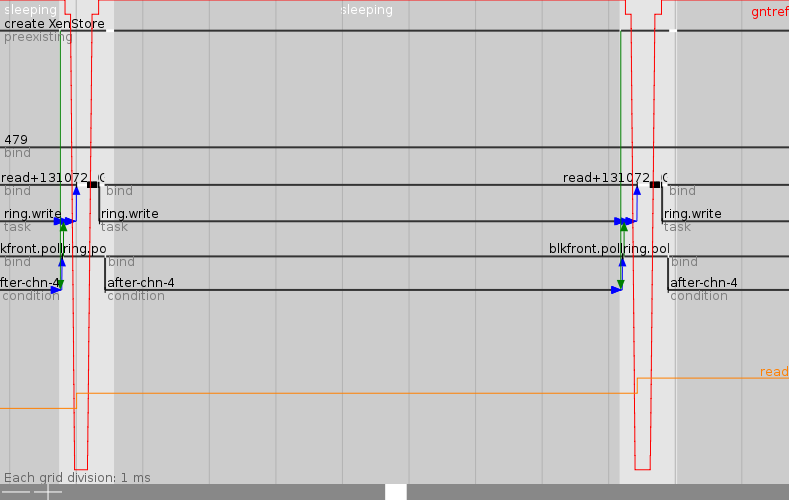

<!-- .slide: class="title" -->

##Trustworthy secure modular operating system engineering
###fun(ctional) operating system and security protocol engineering

David Kaloper and Hannes Mehnert<br/>
<br/>
31st Chaos Communication Congress, 27th Dec 2014


----
## Trusted Computing Base

> The trusted computing base (TCB) of a computer system is the set of all hardware, firmware, and/or software components that are critical to its security, in the sense that bugs or vulnerabilities occurring inside the TCB might jeopardize the security properties of the entire system.

&nbsp; &nbsp; &nbsp; &nbsp; &nbsp; &nbsp; &nbsp; &nbsp; &nbsp; &nbsp;
&nbsp; &nbsp; &nbsp; &nbsp; &nbsp; &nbsp; &nbsp; &nbsp; &nbsp; &nbsp;
&nbsp; &nbsp; &nbsp; &nbsp; &nbsp; &nbsp; &nbsp; &nbsp; &nbsp; &nbsp;
*&mdash; *([Wikipedia](http://en.wikipedia.org/wiki/Trusted_computing_base))*


----
## IM Client TCB

(XXX: kloc would be nice)
+ Client software itself
+ Libraries it depends on (OpenSSL, libotr, libpurple)
+ GUI framework (picture, font renderer)
+ Programming language runtime (Python? Ruby?)
+ C library
+ Memory allocator
+ Operating system kernel (TCP/IP, device drivers)
+ Hardware
+ Compilers

Attack vector is sum of attack vectors in all components!


----
## What can we do?

(XXX: pics would be nice)
+ Compartmentalize
+ Mitigate known vulnerabilities
+ Shrink the TCB


----
## Compartmentalization

Limits the impact of a successful attack.

+ `chroot`
+ FreeBSD jail, Linux containers
+ Hypervisor (Xen / KVM / ..)
+ Docker

Are these mechanisms without flaws? Can an attacker escape a `chroot`?


----
## Mitigate vulnerabilities

Detects and defends against known attacks.

+ Stack protection
+ Firewall
+ IDS

These increase the TCB, there have been issues with firewall implementations.


----
## Shrink TCB

Contradicts computer science law - if in doubt, add another layer of abstraction

We built these huge monolithic systems since the 70s

Well, get over it. Start from scratch. Learn from mistakes. Use decent tools.


----
## Outline

+ Trusted Computing Base (we saw this)

+ Development tools - why functional programming matters

+ Mirage OS overview

+ OCaml-TLS development


----
## Development Tools

You can chose between a manual screwdriver and an electrical screwdriver with laserpointer for aiming and integrated torque tester.

+ Programming language

    + Communication between people
    + Abtraction mechanisms: variables, functions, higher-order functions, monads, ...
    + Type system finds errors at compile time
    + Fewer boilerplate and bookkeeping lets you focus on the problem
    + Shared mutable state is the root of all evil!
    + Automated memory management is not rocket science anymore


----
## Functional programming

+ Explicitly mark side effects (these are dangerous areas in your program)!

    + Network input/output
    + User input/output
    + Mutation of memory

+ Declarative programming makes code readable
+ Algorithmic core is easily comprehensible


----
## Motivation

Complexity kills you:

+ Applications are **deeply intertwined** with system APIs, and so lack
  portability
+ Modern operating systems offer **dynamic support** for **many users** to run
  **multiple applications** simultaneously

Almost unbounded scope for uncontrolled interaction!

+ Why should my DNS server have a file system? User management? Processes?
+ Ad hoc application configuration under `/etc`
+ Complex configuration management, eased by shell scripts
+ But: shell becomes part of TCB (Shellshock!)


----
## Mirage OS

+ From scratch modular operating system
+ Started 2009 as research project at University of Cambridge, UK
+ BSD/MIT licensed
+ Completely written in OCaml
+ Targets: UNIX binary, Xen virtual machine, FreeBSD kernel module, JavaScript, ...


----
## The Unikernel Approach

> __Unikernels__ are specialised virtual machine images compiled from the
> modular stack of application code, system libraries and configuration

<br/>
This means they realise several benefits:
<!-- .element: class="fragment" data-fragment-index="2" -->

+ __Contained__, simplifying deployment and management
+ __Compact__, reducing attack surface and boot times
+ __Efficient__, able to fit 10,000s onto a single host
+ __Portable__, to many compilation environments beyond Xen

<!-- .element: class="fragment" data-fragment-index="2" -->


----
## Mirage on Xen

+ No processes, file system, user management
+ Single address space
+ No C library (we use openlibm and have printf)
+ OCaml runtime including garbage collector
+ Runs on either amd64 or ARM

<p class="stretch center">
  
</p>


----
## Intermission

<p class="stretch center">
  
</p>


----
## Interlude: Cubieboard 2

+ __AllWinnerTech SOC A20, ARM Cortex-A7 Dual-Core__
+ GPU: ARM Mali400 MP2 (OpenGL ES 2.0/1.1)
+ 1GB DDR3, 3.4GB internal NAND flash
+ 10/100 ethernet, support USB WiFi
+ 2x USB 2.0 HOST, mini USB 2.0 OTG, micro SD, SATA
+ HDMI 1080P display output
+ IR, line in, line out, 96 extend PIN interface, including I2C, SPI, RGB/LVDS, CSI/TS, FM-IN, ADC, CVBS, VGA, SPDIF-OUT, R-TP, and more
+ roughly 40 &euro;


----
## Modularizing the OS

<p class="stretch center">
  
</p>


----
## Modularizing the OS

<p class="stretch center">
  
</p>


----
## Modularizing the OS

<p class="stretch center">
  
</p>


----
## Modularizing the OS

Run the same code as:

+ native UNIX binary
+ Xen virtual machine on your ARM board
+ Amazon EC2 instance
+ FreeBSD kernel module
+ Inside of your web browser


----
## Performance

+ On par with Linux on ARM serving HTTP
+ We cut lots of layers and have a single address space
+ Startup time below 20ms (we start services on demand - when a DNS request came in)


----
## Mirage OS

+ Irmin, persistent branchable store (similar to git, but in OCaml)
+ ARM
+ OCaml-TLS
+ Xentropyd
+ Devices are modules, refinement via module system
+ Configuration at compile time
+ www.openmirage.org is on GitHub - including the virtual machines (automatically built and deployed by a push)!
+ Size: web server including TCP/IP, TLS, etc. is below 2 MB


----
## Tracing

<p class="stretch center">
  
</p>


----
## OCaml-TLS design goals

+ Protocol logic encapsulated in declarative functional core

+ Side effects isolated in frontends

+ Concise, useful, well-designed API

<p class="stretch center">
  
</p>


----
## What is TLS?

+ Cryptographically secure channel (TCP) between two nodes

+ Most widely used security protocol (since > 15 years)

+ Protocol family (SSLv3.0, TLS 1.0, 1.1, 1.2)

+ Algorithmic agility: negotiation of key exchange, cipher and hash

+ Uses X.509 (ASN.1 encoding) PKI for certificates


----
## Protocol details

+ Security properties:

    + Authentication (optional mutual)
    + Secrecy
    + Integrity
    + Confidentiality
    + Forward secrecy (using ephemeral Diffie Hellman)

+ Handshake, Change Cipher Spec, Alert, Application Data, Heartbeat subprotocols


----
## Authentication (X.509)

+ Client has set of trust anchors (CA certificates)

+ Server has certificate signed by a CA

+ During handshake client receives server certificate chain

+ Client verifies that server certificate is signed by a trust anchor


----
## Handshake

Showing live at

````
cd mirage/tls-demo-server
./main.native
````

[https://127.0.0.1:4433](https://127.0.0.1:4433)


----
## Code statistics

+ Disclaimer: ``cloc`` statistics, use with a grain of salt

+ Linux kernel, glibc (1187), apache (209), OpenSSL (354): 17553kloc code (mostly C)

+ Mirage OS, cohttp, OCaml-TLS: 125kloc (75 C, 43 OCaml, 7 assembly)
   + 26 C: OCaml runtime
   + 17 C: MiniOS
   + 22 C: OpenLibm
   + 8 C + 7 asm: gmp


----
## Trusted Code Base

+ Linux network device driver (separate Xen domain)
+ Xen hypervisor
+ OpenLibm math library
+ MiniOS
+ GNU multiple precision library
+ OCaml runtime
+ OCaml and C compiler
+ Various OCaml libraries: cstruct, zarith, cohttp, x509, asn1, tls, nocrypto


----
## Conclusion

+ Operating systems in a functional language is fun and achievable!

+ Working hard on support for various protocols

+ Starting from scratch: 350kloc vs 20kloc for TLS

+ Join the #nolibc movement

+ Everything BSD-licensed, and available via OPAM (OCaml package manager)

+ [Jackline](https://github.com/hannesm/jackline) is a command-line XMPP client using OCaml-TLS, XMPP, OTR

+ [Blog series about OCaml-TLS http://openmirage.org/blog/introducing-ocaml-tls](http://openmirage.org/blog/introducing-ocaml-tls)

+ [http://openmirage.org](http://openmirage.org)


----
## Thanks

+ Anil Madhavapeddy
+ Peter Sewell
+ Richard Mortier, John Crowcraft, Thomas Leonard
+ The whole Mirage team in Cambridge, OCamllabs
+ miTLS team
+ [http://openmirage.org](http://openmirage.org)
