<!-- .slide: class="title" -->

##Trustworthy secure modular operating system engineering
###fun(ctional) operating system and security protocol engineering

David Kaloper and Hannes Mehnert<br/>
<br/>
31st Chaos Communication Congress, 27th Dec 2014


----
## Trusted Computing Base

> Trusted computing base (TCB) of a computer system is all hardware and software that is critical to its security; bugs inside the TCB jeopardize security properties of entire system.

&nbsp; &nbsp; &nbsp; &nbsp; &nbsp; &nbsp; &nbsp; &nbsp; &nbsp; &nbsp;
&nbsp; &nbsp; &nbsp; &nbsp; &nbsp; &nbsp; &nbsp; &nbsp; &nbsp; &nbsp;
*&mdash; *([Wikipedia](http://en.wikipedia.org/wiki/Trusted_computing_base)), shortened*


----
## TCB of IM Client

Client software 


----
## TCB of IM Client


Dependencies (crypto, XML, ...) 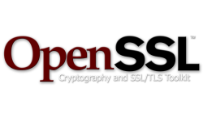


----
## TCB of IM Client


GUI framework (picture, font renderer) 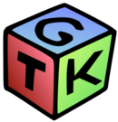


----
## TCB of IM Client


Programming language runtime 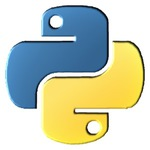


----
## TCB of IM Client

C library <p class="stretch center">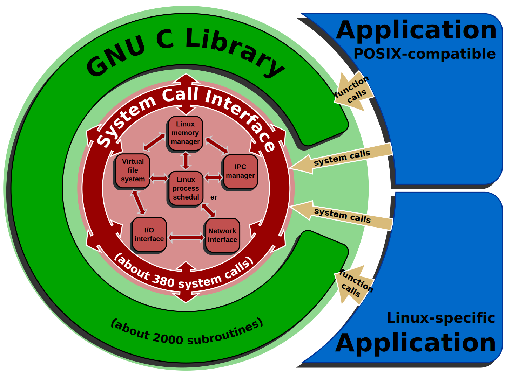</p>


----
## TCB of IM Client

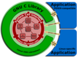

Operating system (TCP/IP, device drivers) 


----
## TCB of IM Client


Hardware 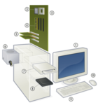


----
## Weakest link?


----
## What can we do?


----
## Compartments

<p class="stretch center">
  
</p>

Limits the impact of a successful attack.

+ `chroot`, Solaris Zones, FreeBSD jail, Linux containers, Docker
+ Hypervisor such as Xen, KVM, ... used for Amazon EC2, Rackspace, ...


----
## Compartments

+ Can an attacker escape a `chroot`?

<p class="stretch center">
  
</p>


----
## More layers

Detect known attacks by adding another layer.

<p class="stretch center">
  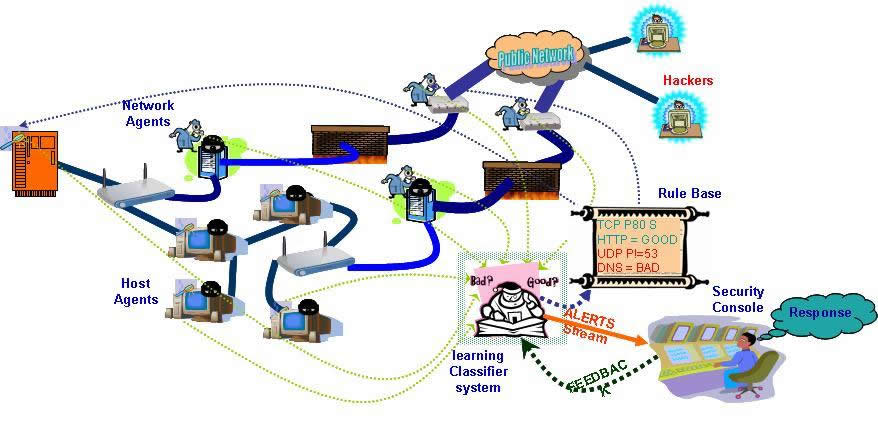
</p>

+ ASLR stack protection
+ Firewall
+ Intrusion detection systems


----
## Piling Layers

> All problems in computer science can be solved by another level of indirection... Except for the problem of too many layers of indirection.
&nbsp; &nbsp; &nbsp; &nbsp; &nbsp; &nbsp; &nbsp; &nbsp; &nbsp; &nbsp;
&nbsp; &nbsp; &nbsp; &nbsp; &nbsp; &nbsp; &nbsp; &nbsp; &nbsp; &nbsp;
&nbsp; &nbsp; &nbsp; &nbsp; &nbsp; &nbsp; &nbsp; &nbsp; &nbsp; &nbsp;
*&mdash; *David Wheeler

<p class="stretch center">
  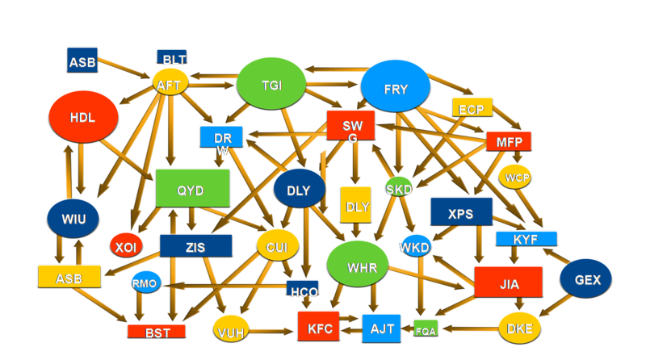
</p>


----

<p class="stretch center">
  
</p>


----
## Clean slate

+ Software systems are complex
+ Communication via protocols
+ API of the Internet: TCP/IP, DHCP, DNS, HTTP, TLS, SASL, XMPP, GIT, SSH, IMAP, ...
+ Persistent data storage


----
## Our Tools

+ Programming language
+ Abstraction features
+ Libraries


----
## Programming Language

+ Concise readable code is the goal
+ Focus on problem, do not distract with boilerplate
+ Abstraction crucial for handling complex systems
    + Variables, functions, higher-order functions, modules, ..


----
## Functional programming

+ Small composable functions
+ Allows readable **declarative** programming

````
let l1 = [ 1 ; 2 ; 3 ] in
List.map (fun x -> x + 1) l1

>> [ 2 ; 3 ; 4 ]

l1
>> [ 1 ; 2 ; 3 ]
````


----
## Type systems

+ Lightweight invariants
+ Type systems spot errors at compile time
+ Early error detection crucial for critical services
+ Type driven development


----
## Side Effects

Side effects are mutation of state which are observable outside of a function in addition to their return value.

+ Hard to reason locally when side effects are there
+ Functional programming marks them explicitly

<p class="stretch center">
  
</p>


----
## Unikernel

> __Unikernels__ are specialised virtual machine images compiled from the
> modular stack of application code, system libraries and configuration


----
## Mirage OS

+ Started in 2009 at University of Cambridge, UK
+ BSD/MIT licensed
+ OCaml, a modular functional programming language
+ Compiles to a Xen virtual machine (amongst others)
+ 2MB virtual machine size (for HTTPS server)


----
## Mirage on Xen

<p class="stretch center">
  
</p>

+ Single address space
+ No C library


----
## Modularity

+ Modules are composable units assembling complex systems together
+ Mirage leverages the module system from OCaml
+ Same application code can use various stacks


----
## Modularize the OS

<p class="stretch center">
  
</p>


----
## Modularize the OS

<p class="stretch center">
  
</p>


----
## Modularize the OS

<p class="stretch center">
  
</p>


----
## Intermission

<p class="stretch center">
  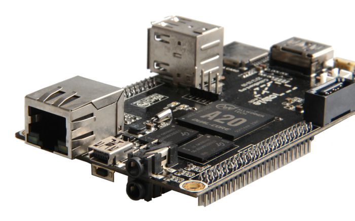
</p>


----
## Cubieboard 2

+ __AllWinnerTech SOC A20, ARM Cortex-A7 Dual-Core__
+ 1GB DDR3
+ 10/100 ethernet, support USB WiFi
+ 2x USB 2.0 HOST, micro SD, SATA
+ HDMI
+ ...


----
## Xen security

+ Each PCI ID can be driven in a separate VM (Qubes)
+ Hypervisor (with hardware support) separates VMs
+ Inside of VM: network interface is mapped as shared memory
+ Inter-VM communication via shared memory possible


----
## What Mirage can

+ TCP/IP, DHCP, HTTP, DNS, IMAP, ...
+ Irmin, persistent branchable store (similar to git)
+ Transport layer security (TLS)
+ Deployment via git - small VM size


----
## Performance

+ Similar to Linux on ARM (serving static HTTP data)
+ Startup time really fast 20ms
+ DNS server starts unikernel when service requested
+ Services on-demand


----
## What is TLS?

+ Transport layer security
+ Most widely used security protocol since 1999
+ Algorithmic agility: negotiation of key exchange, cipher and hash
+ Trust anchors (certificate authorities, X.509)


----
## Handshake

Tracing of our server side stack

Showing live at

````
cd mirage/tls-demo-server
./main.native
````

[https://tls.openmirage.org](https://tls.openmirage.org)


----
## OCaml-TLS

<p class="stretch center">
  
</p>

+ Early 2014 in Mirleft - before `goto fail`, Heartbleed


----
## OCaml-TLS

+ Crypto primitives `nocrypto`
+ X.509 certificate verification (ASN.1)
+ Design goal: simplicity
+ Complex TLS APIs are used wrongly (see "The most dangerous code in the wild" and "Frankencert")


----
## Nocrypto

> Never develop your own crypto library

+ Someone has to develop crypto libraries
+ Variety is better than monoculture
+ Read relevant literature
+ Don't invent your own cryptosystem!


----
## Nocrypto

+ Cipher cores in C - allocation and loop free code
+ Cipher modes in OCaml - ECB, CBC, CTR, GCM, CCM
+ Fortuna RNG
+ RSA/DSA/DH (bignums via GNU gmp)
+ Hashes and HMAC - cores again in C


----
## ASN.1

+ Abstract syntax notation, version 1
+ Language for describing tag-length-value data

```
-- Simple name bindings
UniqueIdentifier ::= BIT STRING

-- Products
Validity ::= SEQUENCE {
  notBefore Time,
  notAfter  Time
}

-- Sums
Time ::= CHOICE {
  utcTime     UTCTime,
  generalTime GeneralizedTime
}
```


----
## Asn1-combinators

+ Parser and generator combinators
+ BER and DER encoding
+ Up to full X.509v3 certificates

```
(* Simple name bindings *)
let uniqueIdentifier = bit_string

(* Products *)
let validity =
  sequence2
    (required ~label:notBefore time)
    (required ~label:notAfter time)

(* Sums *)
let time = choice2 utc_time generalized_time
```


----
## X.509 authenticator

````
val chain_of_trust : ?time:float -> Cert.t list -> t

val server_fingerprint : ?time:float -> hash:hash ->
  fingerprints:(string * Cstruct.t) list -> t
````

Hostname is always verified!

Either RFC 5280 chain of trust or trust on first use.


----
## OCaml-TLS

+ Protocol logic in pure core

````
val handle_tls : state -> Cstruct.t ->
  | `Ok of [ `Ok of state | `Eof | `Alert of alert ]
         * [ `Response of Cstruct.t option ]
         * [ `Data of Cstruct.t option ]
  | `Fail of alert * [ `Response of Cstruct.t ]

val send_application_data : state -> Cstruct.t list ->
  (state * Cstruct.t) option
````


----
## OCaml-TLS

+ Effectful layers for `lwt` and `mirage`
+ Network input and output
+ Hide details from developer

````
val accept : X509_lwt.priv -> Lwt_unix.file_descr ->
  ((ic * oc) * Lwt_unix.sockaddr) Lwt.t

val connect : X509_lwt.authenticator -> string * int ->
  (ic * oc) Lwt.t
````


----
## OCaml-TLS

+ Interoperability with various stacks (demo server > 50000 sessions)
+ Developed working TLS stack in short time frame
+ Learned patterns for robust implementation of security protocols
+ 350 000 loc (OpenSSL) vs 100 000 (PolarSSL) 20 000 loc (OCaml-TLS)
  (used `cloc` for counting)


----
## OCaml-TLS Future

+ Client authentication
+ AEAD ciphers
+ Server-side SNI configuration
+ No session resumption
+ No elliptic curve cryptography


----
## Moving Forward

+ Healthy functional code base easy to extend
+ [Conduit](https://github.com/mirage/ocaml-conduit) - abstracting over connections (shared memory (Xen vchan), TCP, TLS, ..)
+ November: [Ocaml-OTR](https://github.com/hannesm/ocaml-otr) - DSA for nocrypto, no socialists millionairs problem
+ December: [Jackline](https://github.com/hannesm/jackline) - command-line XMPP client

<p class="stretch center">
  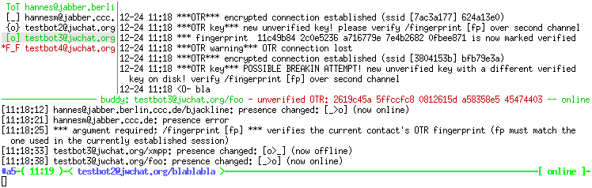
</p>


----
## Trusted Code Base

+ Xen hypervisor
+ MiniOS (printf, other stubs)
+ OpenLibm math library
+ GNU multiple precision library
+ OCaml runtime
+ OCaml libraries: cstruct, zarith, cohttp, x509, asn1, tls, nocrypto
+ OCaml and C compiler


----
## Conclusion

+ Functional operating systems are real now!
+ Why OCaml? Also Haskell (HalVM), Erlang on Xen, ...
+ Fuck legacy and traditions, let's start to build secure and resilient systems!
+ Keep it simple, complexity is the enemy
+ Join our #nolibc movement
+ [Blog series about OCaml-TLS, ...](http://openmirage.org/blog/introducing-ocaml-tls)
+ [http://openmirage.org](http://openmirage.org)


----
## We need help

+ Try mirage out, write code, audit code, break code
+ Discuss design choices and code pieces with us
+ 31c3: coffeenerds (4th floor, [@espressobicycle](https://twitter.com/espressobicycle))

<p class="stretch center">
  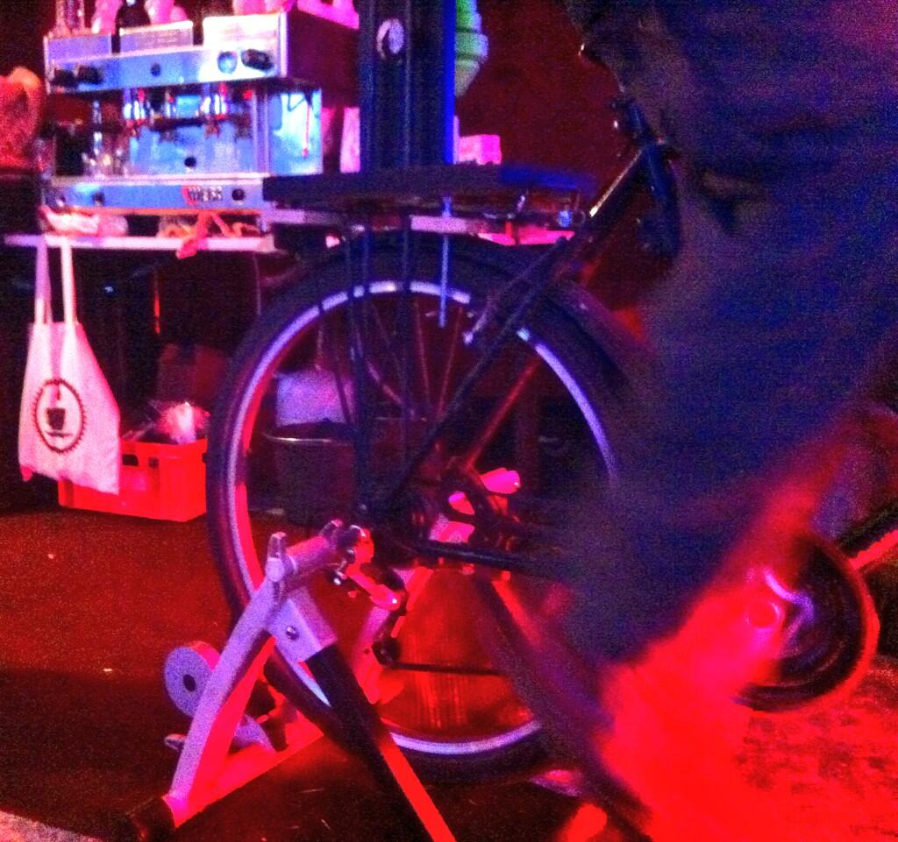
</p>


----
## Thanks

+ Anil Madhavapeddy
+ Peter Sewell - talks here<br/>
Why computers are so @#!* - Day 4, 12:45, Saal 1
+ Daniel B&uuml;nzli, Thomas Leonard, Thomas Gazagnaire, Dave Scott, Richard Mortier, Jon Crowcraft
+ Edwin T&ouml;r&ouml;k, Andreas Bogk, Gregor Kopf
+ Mirage team in Cambridge, OCaml Labs
+ miTLS team - formally verified TLS stack in F7/F#
+ All we forgot (sorry!)
