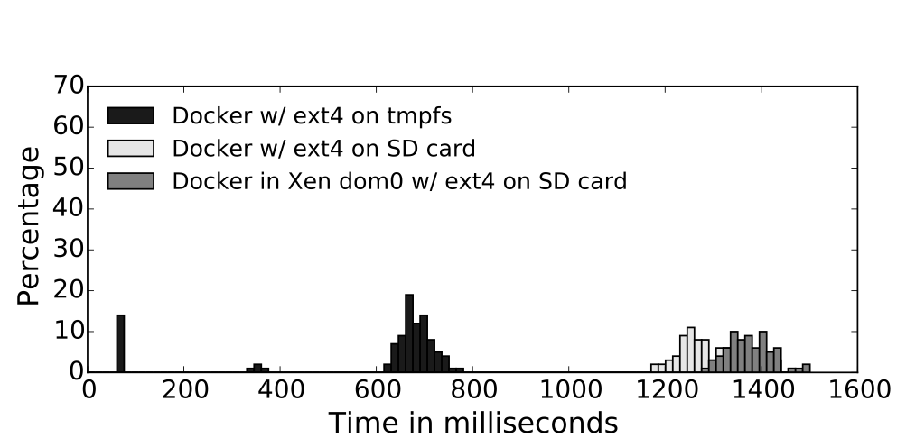
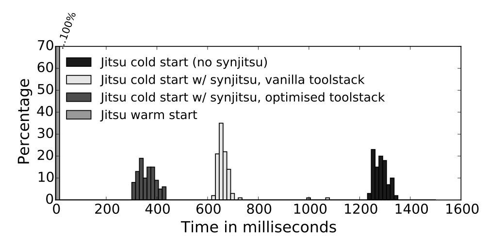
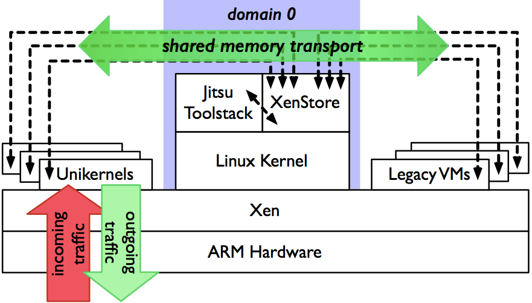
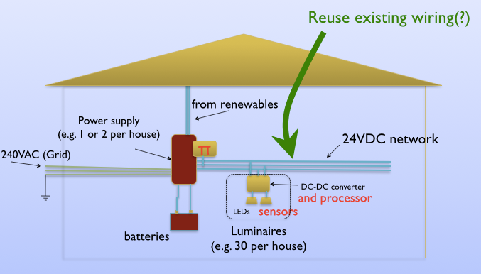

<!-- .slide: class="title" -->

# **Let a Billion Clouds Bloom**

Anil Madhavapeddy
[@avsm](http://twitter.com/avsm), 
Jon Crowcroft
[@tforcworc](http://twitter.com/tforcworc), 
Ian Leslie,
*Cambridge Computer Laboratory*

[http://nymote.org/](http://nymote.org/) 
[http://openmirage.org/](http://openmirage.org/) 
[http://decks.openmirage.org/bt2014/](http://decks.openmirage.org/bt2014/#/)

<small>
  Press &lt;esc&gt; to view the slide index, and the &lt;arrow&gt; keys to
  navigate.
</small>

----

## The IoT Spring

## The Past Few Months

* **Heartbleed**: 17% of *all* Internet secure web servers vulnerable to a single bug. Described as "catastrophic" by Bruce Schneier.
* **ShellShock**: CGI, Web, DHCP all vulnerable to code execution. Millions of sites potentially vulnerable.
* **JP Morgan**: 76 million homes and 8 million small businesses exposed in a single data breach.
* **Target**: 40 million credit cards stolen electronically.

> System security is in a disastrous state, and seemingly getting worse.

## Architectural Thoughts

We can improve the resilience of the global Internet by:

* shifting to **decentralised services** that run near the user.
* Reduced **remote data transmission**: but still a huge telco opportunity for pervasive wireless and backhaul.
* need a **fundamental overhaul in security** of edge nodes to build a layer of assurance.

## Solution: [nymote.org](http://nymote.org/)

A system of distributing computation to the edge networks:

+ Millions of ARM devices forming **edge cloud** infrastructure.

+ We now need to be able to run our own nodes **independently**.

+ **Without** having to become (Linux) **sysadmins**!

> 
How can we achieve this and what are the implications on Internet architecture?

## A Few Technologies

I'll run through some ongoing Cambridge Computer Laboratory programs that form Nymote:

* **Mirage**: the *unikernel* operating system approach to delivering secure services on edge nodes.

* **Jitsu**: Just-in-time Summoning of Unikernels to integrate with network requests in milliseconds.

* **Illuminate**: Building Buildings

----

## Introducing [Mirage OS 2.0](http://openmirage.org/)

These slides were written using Mirage on OSX:

- They are hosted in a **938kB Xen unikernel** written in statically type-safe
  OCaml, including device drivers and network stack.

- Their application logic is just a **couple of source files**, written
  independently of any OS dependencies.

- Running on an **ARM** CubieBoard2, and hosted on the cloud.

- Binaries small enough to track the **entire deployment** in Git!

## Introducing [Mirage OS 2.0](http://openmirage.org/)

  

## Leaning Tower of Cloud

  
Numerous pain points:

  <ul>
    <li>**Complex** configuration management.</li>
    <li>Duplicated functionality leads to **inefficiency**.</li>
    <li>VM image size leads to **long boot times**.</li>
    <li>Lots of code means a **large attack surface**.</li>
  </ul>

  
   <small>
    https://flic.kr/p/8N1hWh
  </small>

## Complexity Kills You

The enemy is **complexity**:

+ Applications are **deeply intertwined** with system APIs, and so lack
  portability.

+ Modern operating systems offer **dynamic support** for **many users** to run
  **multiple applications** simultaneously.

Almost unbounded scope for uncontrolled interaction!

<!-- .element: class="fragment" data-fragment-index="1" -->

+ Choices of distribution and version.
+ Ad hoc application configuration under `/etc/`
+ Platform configuration details, e.g., firewalls.

<!-- .element: class="fragment" data-fragment-index="1" -->

## Docker: Containerisation

  

  <small>
    https://flic.kr/p/qSbck
  </small>

## Docker: Containerisation

Docker bundles up all this state making it easy to transport, install and manage.

  

## Can We Do Better?

**Disentangle applications from the operating system**.

- Break up operating system functionality into modular libraries.

- Link only the system functionality your app needs.

- Target alternative platforms from a single codebase.

## The Unikernel Approach

> Unikernels are specialised virtual machine images compiled from the full stack
> of application code, system libraries and config

 
This means they realise several benefits:
<!-- .element: class="fragment" data-fragment-index="1" -->

+ __Contained__, simplifying deployment and management.
+ __Compact__, reducing attack surface and boot times.
+ __Efficient__, able to fit 10,000s onto a single host.

<!-- .element: class="fragment" data-fragment-index="1" -->

## It's All Just Source Code

Capture system dependencies in code and compile them away. 

  &nbsp;

  

## Retarget By Recompiling

Swap system libraries to target different platforms: 
**develop application logic using native Unix**.

  

## Retarget By Recompiling

Swap system libraries to target different platforms: 
**test unikernel using Mirage system libraries**.

  

## Retarget By Recompiling

Swap system libraries to target different platforms: 
**deploy by specialising unikernel to Xen**.

  

## End Result?

Unikernels are compact enough to boot and respond to network traffic in
real-time.

<table style="border-bottom: 1px black solid">
  <thead style="font-weight: bold">
    <td style="border-bottom: 1px black solid; width: 15em">Appliance</td>
    <td style="border-bottom: 1px black solid">Standard Build</td>
    <td style="border-bottom: 1px black solid">Dead Code Elimination</td>
  </thead>
  <tbody>
    <tr style="background-color: rgba(0, 0, 1, 0.2)">
      <td>DNS</td><td>0.449 MB</td><td>0.184 MB</td>
    </tr>
    <tr>
      <td>Web Server</td><td>0.674 MB</td><td>0.172 MB</td>
    </tr>
    <tr style="background-color: rgba(0, 0, 1, 0.2)">
      <td>Openflow learning switch</td><td>0.393 MB</td><td>0.164 MB</td>
    </tr>
    <tr>
      <td>Openflow controller</td><td>0.392 MB</td><td>0.168 MB</td>
    </tr>
  </tbody>
</table>

## End Result?

Unikernels are compact enough to boot and respond to network traffic in
real-time.

----

## Git Your Own Cloud

Unikernels are **small enough to be tracked in GitHub**. For example, for the
[Mirage website](http://openmirage.org/):

1. Source code updates are merged to **[mirage/mirage-www](https://github.com/mirage/mirage-www)**;

2. Repository is continuously rebuilt by
  **[Travis CI](https://travis-ci.org/mirage/mirage-www)**; if successful:

3. Unikernel pushed to  **[mirage/mirage-www-deployment](https://github.com/mirage/mirage-www-deployment)**;
  and

4. Our cloud toolstack spawns VMs based on pushes there.

**Our *entire* cloud-facing deployment is version-controlled from the source code
up**!

## Mirage OS 2.0 Workflow

As easy as 1&mdash;2&mdash;3!

1. Write your OCaml application using the Mirage module types.
   + Express its configuration as OCaml code too!

           $ mirage configure app/config.ml --unix
<!-- .element: class="no-highlight" -->

## Mirage OS 2.0 Workflow

As easy as 1&mdash;2&mdash;3!

1. Write your OCaml application using the Mirage module types.
   + Express its configuration as OCaml code too!

2. Compile it and debug under Unix using the `mirage` tool.

         $ cd app
         $ make depend # install library dependencies
         $ make build  # build the unikernel
<!-- .element: class="no-highlight" -->

## Mirage OS 2.0 Workflow

As easy as 1&mdash;2&mdash;3!

1. Write your OCaml application using the Mirage module types.
   + Express its configuration as OCaml code too!

2. Compile it and debug under Unix using the `mirage` tool.

3. Once debugged, simply retarget it to Xen, and rebuild!

          $ mirage configure app/config.ml --xen
          $ cd app && make depend && make build
<!-- .element: class="no-highlight" -->

   + All the magic happens via the OCaml module system.

## Modularizing the OS

  

## Modularizing the OS

  

## Modularizing the OS

  

----

## Git Your Own Cloud

Unikernels are **small enough to be tracked in GitHub**. For example, for the
[Mirage website](http://openmirage.org/):

1. Source code updates are merged to **[mirage/mirage-www](https://github.com/mirage/mirage-www)**;

2. Repository is continuously rebuilt by
  **[Travis CI](https://travis-ci.org/mirage/mirage-www)**; if successful:

3. Unikernel pushed to  **[mirage/mirage-www-deployment](https://github.com/mirage/mirage-www-deployment)**;
  and our

4. Cloud toolstack spawns VMs based on pushes there.

**Our *entire* cloud-facing deployment is version-controlled from the source code
up**!

## Implications

**Historical tracking of source code and built binaries in Git(hub)**.

+ `git tag` to link code and binary across repositories.
+ `git log` to view deployment changelog.
+ `git pull` to deploy new version.
+ `git checkout` to go back in time to any point.
+ `git bisect` to pin down deployment failures.

## Implications

Historical tracking of source code and built binaries in Git(hub).

**Low latency deployment of security updates**.

+ No need for Linux distro to pick up and build the new version.
+ Updated binary automatically built and pushed.
+ Pick up latest binary directly from repository.
+ Statically type-checked language prevents classes of attack.

## Implications

Historical tracking of source code and built binaries in Git(hub).

Low latency deployment of security updates.

**Unified development for cloud and embedded environments**.

+ Write application code once.
+ Recompile to swap in different versions of system libraries.
+ Use compiler optimisations for exotic environments.

## Open-Source Community

Mirage OS 2.0 is an important step forward, supporting **more**, and **more
diverse**, **backends** with much **greater modularity**.

For information about the many components we could not cover here, see
[openmirage.org](http://openmirage.org/blog/):

+ __[Irmin](http://openmirage.org/blog/introducing-irmin)__, Git-like
  distributed branchable storage.
+ __[OCaml-TLS](http://openmirage.org/blog/introducing-ocaml-tls)__, a
  from-scratch native OCaml TLS stack.
+ __[Vchan](http://openmirage.org/blog/update-on-vchan)__, for low-latency
  inter-VM communication.
+ __[Cmeleon](http://openmirage.org/blog/modular-foreign-function-bindings)__,
  modular C foreign function bindings.

----

## Jitsu: an embedded cloud

Mirage lets us deploy microservices via unikernels to remote nodes quickly
and securely.  

> How do we tie these unikernels to realistic network services like HTTP?

 
**Jitsu** is a cloud toolstack designed for use in embedded systems
running on edge networks.
Responsible for **service provision without sacrificing isolation** on edge
nodes.

## The Jitsu Network Flow

* A user makes a DNS request for `wikipedia.org`
* Jitsu node receives local request and starts a virtual machine.
* While the unikernel boots, it buffers TCP traffic.
* When booting is complete, the unikernel responds directly.

 
> The local copy of wikipedia is running inside a completely isolated VM,
> unlike current monolithic embedded system stacks.

## Docker HTTP Latency

## Jitsu HTTP Latency

## HTTP Latency Summary

For the initial HTTP request from a cold start, observed latency is:

* a full Linux VM: > 5 seconds
* a Docker container: ~1.4 seconds
* a Jitsu unikernel: ~0.3 seconds

## Reminder: Docker

  

## Reminder: Mirage/Jitsu

  

## Jitsu Services

What sort of services go inside a BT HomeHub?

* uPnP
* Multicast DNS
* Content Filtering
* NAT / Bridging
* Content caching

> All of these are currently controlled by BT.  What if the box could become an app store?

## Jitsu Unikernel Router

With Jitsu, you can now deploy *untrusted* applications to the hubs.

## Recap: Jitsu

* Security and efficiency need not be at odds on embedded systems, due to unikernels and Xen.

* Jitsu maps external network requests onto unikernel instances, balancing resource and power usage.

* Uses same APIs as the Xen stack that runs much of the public cloud.

* We are deploying a Jitsu "community cloud" of cooperating routers around Cambridge to deploy at a larger scale.

----

## Illuminate

----

## <http://openmirage.org/>

Featuring blog posts by:
[Amir Chaudhry](http://amirchaudhry.com/),
[Thomas Gazagnaire](http://gazagnaire.org/),
[David Kaloper](https://github.com/pqwy),
[Thomas Leonard](http://roscidus.com/blog/),
[Jon Ludlam](http://twitter.com/jonludlam),
[Hannes Mehnert](https://github.com/hannesm),
[Mindy Preston](https://github.com/yomimono),
[Dave Scott](http://dave.recoil.org/),
and [Jeremy Yallop](https://github.com/yallop).

  Thanks for listening! Questions? I'm <anil@recoil.org>
  and these slides are at 
  <https://decks.openmirage.org/bt2014>

