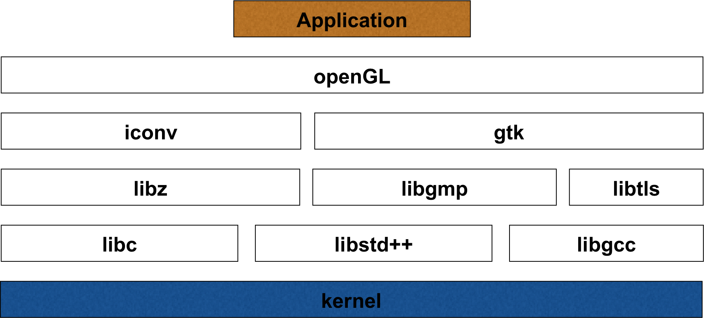
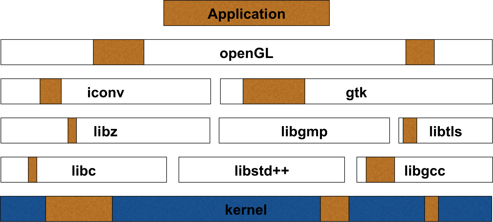
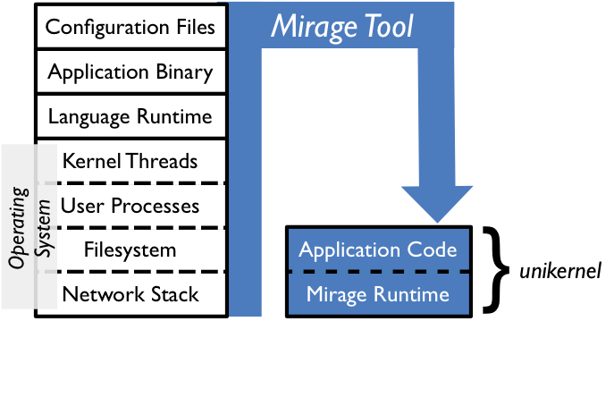
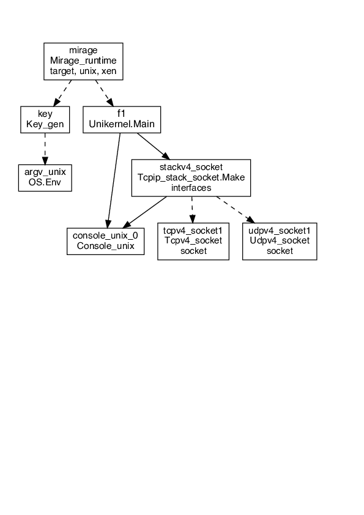
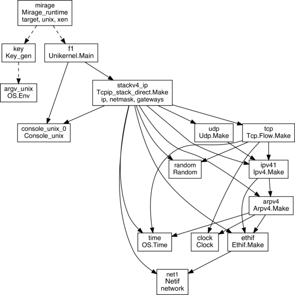
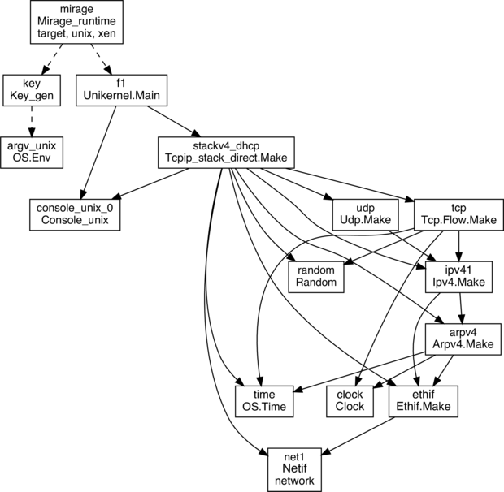

<!-- .slide: class="title" -->

# Knock, Knock:<br/>Unikernels Calling!

Richard Mortier <small>University of Cambridge</small>
[@mort\_\_\_](http://twitter.com/mort___)

<https://mirage.io/><br/>
[http://decks.openmirage.org/cif16-loops/](http://decks.openmirage.org/cif16-loops/#/)

<small>
  Press &lt;esc&gt; to view the slide index, and the &lt;arrow&gt; keys to
  navigate.
</small>


----

# About Me

+ Ph.D. with Systems Research Group at Cambridge University Computer Lab
+ Now faculty at the Cambridge University Computer Lab
+ Previously with University of Nottingham, Microsoft Research, Sprint ATL,
  startups


# About this Deck

_Slides written in statically type-safe OCaml using Mirage on OSX_

- They are hosted on my laptop as a content-specific webserver, connected to
  using a browser
- Their application logic is just a **couple of source files**, written
  independently of any OS dependencies
- **Without any source level changes** then can also be hosted in the cloud as
  an **x86 Xen unikernel** and on **ARM Cubieboard2**
- Binaries small enough to track the **entire deployment** in Git!


----

# Traditional Operating Systems

_A lot of code!_

+ Linux: over 25 million lines of code

+ Debian 5.0: 65 million lines of code

+ OSX 10.4: 85 million lines of code


# Traditional Applications

<p class="center stretch">
  
</p>


# Traditional Applications

<p class="center stretch">
  
</p>


# Tradition

<p class="right" style="width:35%">
  
</p>

<div class="left" style="width: 55%">

  <ul>
    <li>
      Current applications effectively rely on a software stack of 100M+ lines
      of code software stack
    </li>
    <li>
      Most of that stack is written in C, a long time ago
    </li>
    <li>
      As a result, it's hard to re-use it in different &ndash; <b>and new</b>
      &ndash; contexts
    </li>
    <li>
      It's great that we can engineer software to make all this work &ndash; but
      <b>can we do better</b>?
    </li>
</div>


----

# Unikernels!

_Concepts derived from library OS technology from the 1990s_

+ Link application code together with platform libraries at build time
+ Contain only the platform code specifically required by the application
+ Single process, single address space
+ Run anywhere simply by switching out lowest layer libraries during build


# MirageOS Unikernels!

_A unikernel platform built in OCaml_

+ Strongly statically type-safe language dating back to the 1970s

+ Very efficient runtime

+ Builds over the Xen Mini-OS, targeting Xen's stable device driver interface

+ Support for other backends in place and in development, including POSIX, KVM,
  bare-metal, your web browser...


# Benefits

&#x2713;_Reduced attack surface_

<br/>

+ **Static linking of only required libraries**: removes unnecessary services
  &ndash; no Shellshock!

+ **Modern, high-level languages**: static and runtime analysis, dead-code
  elimination


# Benefits

&#x2713;_Reduced attack surface_
&#x2713;_Increased speed_

<br/>

+ **Reduced boot time**: can boot inside a TCP connection setup or packet RTT

+ **Fewer scheduling layers**: lower latency, more predictable performance


# Benefits

&#x2713;_Reduced attack surface_
&#x2713;_Increased speed_

&#x2713;_Efficient resource use_

+ **Reduced memory footprint**: a typical stateless MirageOS app is
  ~10MB of RAM

+ **Small on-disk footprint**: whole-program optimisation can create a MirageOS
  DNS server that comes in at ~200kB


# Benefits

&#x2713;_Reduced attack surface_
&#x2713;_Increased speed_

&#x2713;_Efficient resource use_
&#x2713;_Immutable Infrastructure_

+ **Statically link data into your application**: if desired, reduces dependency
  on external components

+ **Store outputs in Git**: manage via `git`, introducing new models for
  update, upgrade, triage

+ **Can be sealed**: once built, can even enable hardware memory-protection so
  running image is **really** immutable


----

# MirageOS Workflow

_As easy as 1&mdash;2&mdash;3!_

1. Write your OCaml application using the Mirage module types
   + Express its configuration as OCaml code too!

```bash
$ mirage configure app/config.ml --unix # target standard Unix binary
```


# MirageOS Workflow

_As easy as 1&mdash;2&mdash;3!_

1. Write your OCaml application using the Mirage module types
   + Express its configuration as OCaml code too!

2. Compile it and debug under Unix using the `mirage` tool

```bash
$ cd app
$ make depend # install library dependencies
$ make build  # build the unikernel
```


# MirageOS Workflow

_As easy as 1&mdash;2&mdash;3!_

1. Write your OCaml application using the Mirage module types
   + Express its configuration as OCaml code too!

2. Compile it and debug under Unix using the `mirage` tool

3. Once debugged, simply retarget it to Xen, and rebuild!

```bash
$ mirage configure app/config.ml --xen # retarget to Xen
$ cd app && make depend && make build  # rebuild
```

> Magic happens via the **OCaml module system**


----

# MirageOS Technology

_Capture system dependencies in code and compile them away_

<span class="right" style="width: 15em">
  &nbsp;
</span>

<p class="stretch center">
  
</p>


# MirageOS Technology

_A Mirage component usually contains_

- Code parameterised by functors with very limited (Mirage-only) dependencies,
  and particularly __no OS dependencies__

- A collection of libraries where the functors are (fully or partially) applied,
  suitable for interactive use

> Functors in the OCaml module system clearly separate OS component
> dependencies, breaking the monolithic OS down into components


# MirageOS Technology

_Unix/Sockets_

<p class="stretch center">
  
</p>


# MirageOS Technology

_Direct/Static_

<p class="stretch center">
  
</p>


# MirageOS Technology

_Direct/DHCP_

<p class="stretch center">
  
</p>


----

# Demo: Knock Knock!

_The code behind the demo_

+ Single MirageOS unikernel
+ Listens on `80/TCP` as a web proxy
    + Default: returns a basic `hello` page
+ Also has knocking control channel on `32000/TCP`
    + Single request `RESET` to reset knocking state
+ Finally, listens on `[32001,32256]/TCP` for knocks

Once correct knock sequence received, proxy configured to forward HTTP requests
to indicated site instead of returning static page.


# Unikernel Configuration

_`config.ml`_

```ocaml
open Mirage

(* Declare where the unikernel code is *)
let main = foreign
    "Unikernel.Main"              (* the name of the functor *)
    (console @-> stackv4 @-> job) (* the functor signature *)

let packages =  ["mirage-http"] (* additional OPAM packages needed *)
let libraries = ["mirage-http"] (* additional ocamlfind libraries needed *)

(* Register the application *)
let () =
  let stack = generic_stackv4 default_console tap0 in
  register "knocking" ~packages ~libraries [ main $ default_console $ stack ]
```


# Proxy State

_`unikernel.ml`_

```ocaml
module State: sig
  type t
  (** The type for proxy knocking state. *)

  val create: control_port:int -> t
  (** Create a new proxy state. [control_port] is the control port number. *)

  val ports: t -> int list
  (** [ports t] is the sequence of port knocking stored in the state. *)

  val add: t -> int -> unit
  (** [add t port] add [port] to the current observed sequence of ports. *)

  val reset: t -> unit
  (** [reset t] resets the proxy state. *)

  val control_port: t -> int
  (** [control_port t] retrieves the control port number. *)
end
```


# Decoding Knocks

_`unikernel.ml`_

```ocaml
module Hostname (C: CONSOLE): sig

  val decode: C.t -> State.t -> string option
  (** [decode c st] resolves port knocks stored in proxy [!State] [st] into
      hostname. [c] is a console for log output. *)

end = struct

  let log c fmt = ... (* console logging; private to module *)

  (* the ports table, private to module *)
  let table = [
    [1]   , "unikernel.org";
    [1; 2], "mirage.io";
  ]

  let decode c t = ... (* lookup knock sequence in [table] *)

end
```


# Unikernel: Helpers

_`unikernel.ml`_

```ocaml
module Main (C: CONSOLE) (S: STACKV4) = struct

  module Proxy = Proxy(C)(S)
  module Hostname = Hostname(C)

  type request = Reset | Unknown of string
  let string_of_request buf =
    match String.trim (Cstruct.to_string buf) with
    | "reset" -> Reset
    | req     -> Unknown req

  let log c fmt = ...           (* console logger *)
  let ok_or_error dbg c = ...   (* chaining invocations with error handling *)
  let not_found c con = ...     (* port knock not recognised *)
  let reply_one c s t con = match Hostname.decode c t with
    | Some host -> proxy c s con host | None -> not_found c con

  let proxy c s con host = ...
  (* actually proxy incoming request: creates an HTTP server listening thread
     that receives incoming HTTP requests and proxies it to the target host *)
```


# Unikernel: Handling A Knock

_`unikernel.ml`_

```ocaml
 let update c t port flow =
    match port - State.control_port t with
    | 0 ->
      S.TCPV4.read flow >>= fun question ->
      ok_or_error "update" c question >>= fun buf ->
      begin match string_of_request buf with
        | Reset ->
          log c "Port 0: RESET!" >>= fun () ->
          State.reset t;
          S.TCPV4.close flow
        | Unknown req ->
          log c "Port 0: Unknown request (%s)" req >>= fun () ->
          S.TCPV4.close flow
      end
    | port ->
      log c "Port %d: KNOCK KNOCK!" port >>= fun () ->
      State.add t port;
      S.TCPV4.close flow
```


# Unikernel: Entry Point

_`unikernel.ml`_

```ocaml
  let start c s =
    log c "Port Knocking Proxy Unikernel booted!\n"

    >>= fun () ->
    let control_port = 32000 in
    let t = State.create ~control_port in

    (* register a knock handler for all the ports we are interested in *)
    for i = 0 to 256 do
      let port = control_port + i in
      S.listen_tcpv4 s ~port (update c t port)
    done;

    (* start the web proxy on 80/TCP *)
    S.listen_tcpv4 s ~port:80 (reply_one c s t);
    S.listen s
```


----

# The Plumbing

_`main.ml`: autogenerated code to build the functors_

_Unix with kernel socket networking stack_
```ocaml
module Tcpip_stack_socket1 = Tcpip_stack_socket.Make(Console_unix)
```

_Unix with direct networking stack_
```ocaml
module Ethif1 = Ethif.Make(Netif)
module Arpv41 = Arpv4.Make(Ethif1)(Clock)(OS.Time)
module Ipv41 = Ipv4.Make(Ethif1)(Arpv41)
module Udp1 = Udp.Make(Ipv41)
module Tcp1 = Tcp.Flow.Make(Ipv41)(OS.Time)(Clock)(Random)
module Tcpip_stack_direct1 = Tcpip_stack_direct.Make(Console_unix)(OS.Time)
    (Random)(Netif)(Ethif1)(Arpv41)(Ipv41)(Udp1)(Tcp1)
```

_Xen_
```ocaml
...
module Tcpip_stack_direct1 = Tcpip_stack_direct.Make(Console_xen)(OS.Time)
    (Random)(Netif)(Ethif1)(Arpv41)(Ipv41)(Udp1)(Tcp1)
```


# The Plumbing

_`main.ml`: plumb together to create the TCP/IP network stack_

```ocaml
let stackv4_socket1 = lazy (
  let __console_unix_01 = Lazy.force console_unix_01 in
  let __udpv4_socket11 = Lazy.force udpv4_socket11 in
  let __tcpv4_socket11 = Lazy.force tcpv4_socket11 in
  __console_unix_01 >>= function
  | `Error _e -> fail (Failure "console_unix_01")
  | `Ok _console_unix_01 ->
    __udpv4_socket11 >>= function
    | `Error _e -> fail (Failure "udpv4_socket11")
    | `Ok _udpv4_socket11 ->
      __tcpv4_socket11 >>= function
      | `Error _e -> fail (Failure "tcpv4_socket11")
      | `Ok _tcpv4_socket11 ->
        let config = { V1_LWT.name = "stackv4_socket"; console = _console_unix_01 ;
                       interface = (Key_gen.interfaces ()) ; mode = () } in
        Tcpip_stack_socket1.connect config _udpv4_socket11 _tcpv4_socket11
)
```


# The Plumbing

_`main.ml`: plumb together the console and the stack_

```ocaml
let f11 = lazy (
  let __console_unix_01 = Lazy.force console_unix_01 in
  let __stackv4_socket1 = Lazy.force stackv4_socket1 in
  __console_unix_01 >>= function
  | `Error _e -> fail (Failure "console_unix_01")
  | `Ok _console_unix_01 ->
    __stackv4_socket1 >>= function
    | `Error _e -> fail (Failure "stackv4_socket1")
    | `Ok _stackv4_socket1 ->
      Unikernel1.start _console_unix_01 _stackv4_socket1
      >>= fun t -> Lwt.return (`Ok t)
)
```


# The Plumbing

_`main.ml`: plumb together the stack and the platform type_

```ocaml
let mirage1 = lazy (
  let __key1 = Lazy.force key1 in
  let __f11 = Lazy.force f11 in
  __key1 >>= function
  | `Error _e -> fail (Failure "key1")
  | `Ok _key1 ->
    __f11 >>= function
    | `Error _e -> fail (Failure "f11")
    | `Ok _f11 ->
      Lwt.return_unit
)
```


# The Plumbing

_`main.ml`: finally, run the unikernel passing it the plumbed devices_
                                                                    
```ocaml
let run =
  OS.Main.run

let () =
  let t =
    Lazy.force key1 >>= function
    | `Error _e -> exit 1
    | `Ok _ -> Lazy.force mirage1
  in run t
```


----

# <https://mirage.io/>

<p class="left" style="width:43%">
  
</p>

<div class="right" style="width: 55%">
  <p style="font-weight: bold;
            display: float; padding:  0; text-align: center">
    Thanks for listening! Questions?
  </p>

  <p>
    Give it a try: <a href="http://github.com/mor1/loops-mirage/">http://github.com/mor1/loops-mirage/</a>
  </p>

  <p>
    Particular thanks to [Thomas Gazagnaire](http://gazagnaire.org/) for the
    demo unikernel!
  </p>

  <div style="text-align:right">
    <p>
      [`http://mort.io/`](http://mort.io/)
    </p>

    <p>
      [`@mort___`](http://twitter.com/mort___)
    </p

    <p>
      [`richard.mortier@cl.cam.ac.uk`](mailto:richard.mortier@cl.cam.ac.uk)
    </p>
  </div>
</div>
