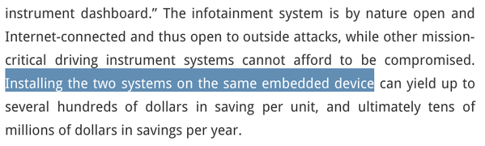
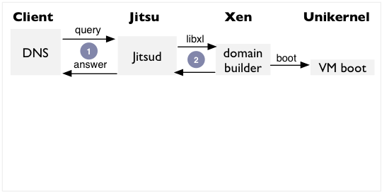
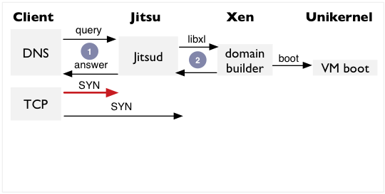
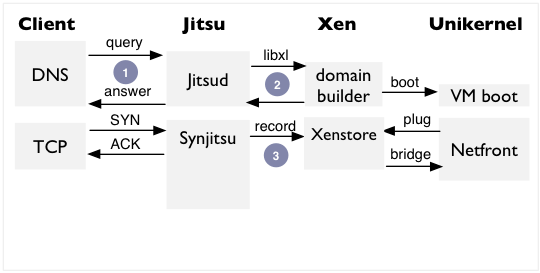
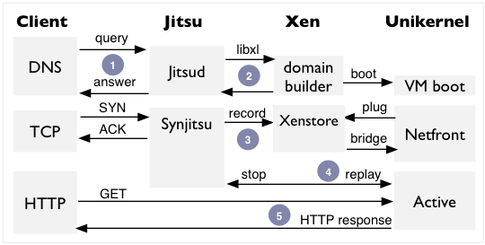

<!-- .slide: class="title" -->

# __Jitsu__: Just-In-Time Summoning of Unikernels

Anil Madhavapeddy <small>University of Cambridge</small>
[@avsm](http://twitter.com/avsm)

Magnus Skjegstad <small>University of Cambridge</small>
[@MagnusS](http://twitter.com/magnuss)

_on behalf of:_ Thomas Gazagnaire, David Scott, Richard Mortier, Thomas Leonard, David Sheets, Amir Chaudhry, Balraj Singh, Jon Crowcroft, Ian Leslie

[http://openmirage.org/](http://openmirage.org/) 
[http://decks.openmirage.org/nsdi2015/](http://decks.openmirage.org/nsdi2015/#/)

<small>
  Press &lt;esc&gt; to view the slide index, and the &lt;arrow&gt; keys to
  navigate.
</small>

----

## The IoT Spring

## Faster than Light?

Many network services suffer as _latency_ increases, e.g.,

+ Siri
+ Google Glass

...to say nothing of how they operate when disconnected.

> So let's move the computation closer to the data and
> reduce dependency on a remote cloud

<!-- .element: class="fragment" data-fragment-index="1" -->

## The Past Year

* **Heartbleed**: 17% of *all* Internet secure web servers vulnerable to a single bug. Described as "catastrophic" by Bruce Schneier.
* **ShellShock**: CGI, Web, DHCP all vulnerable to code execution. Millions of sites potentially vulnerable.
* **JP Morgan**: 76 million homes and 8 million small businesses exposed in a single data breach.
* **Target**: 40 million credit cards stolen electronically.

> System security is in a disastrous state, and seemingly getting worse with IoT.

## Stronger than steel?

We earlier noted the many recent network security problems:

+ Heartbleed
+ Shellshock

...and such bugs will reoccur, now in our homes, cars, fridges

> So let's build fundamentally more robust edge network services

<!-- .element: class="fragment" data-fragment-index="1" -->

----

## The Challenges

* **VMs are the strongest practical isolation on physical devices**
  * *But resource heavy on embedded devices*
  * *Long boot times and management overheads*
* **Containers are really easy to use**
  * *But isolation is poor due to wide interfaces*
  * *Often requires disk I/O to boot*

> Can we eliminate tradeoff between latency and isolation at the edge?

## Meanwhile, in your car...

--  [embedded-computing.com](http://embedded-computing.com/articles/virtualizations-impact-mobile-devices-the-iot/#) via [@whitequark](https://twitter.com/whitequark/status/595918241224097792)

## The Unikernel Approach

> Unikernels are specialised virtual machine images compiled from the full stack
> of application code, system libraries and config

 
This means they realise several benefits:
<!-- .element: class="fragment" data-fragment-index="1" -->

+ __Contained__, simplifying deployment and management.
+ __Compact__, reducing attack surface and boot times.
+ __Efficient__, able to better use host resources.

<!-- .element: class="fragment" data-fragment-index="1" -->

## Real Time Boot

Unikernels can boot and respond to network traffic in
real-time.

<small>*See Also:* HotCloud 2011, ASPLOS 2013, Communications of the ACM Jan 2014</small>

----

## Contributions

Built platform support required for ARM cloud deployments:

* **Ported unikernels to the new Xen/ARMv7 architecture**
  * *Runs VMs on commodity ARM hardware (Cubieboard)*
  * *Type-safe, native code down to the device drivers*

* **Constructed Jitsu toolstack to launch unikernels on-demand**
  * *Race-free booting of unikernels in response to DNS*

* **Evaluated against alternative service isolation techniques**
  * *E.g. Docker containers*

## Artifact: [Mirage OS 2.0](http://openmirage.org/)

These slides were written using MirageOS on Mac OS X:

- They are hosted in a **2MB Xen unikernel** written in statically type-safe
  OCaml, including device drivers and network stack.

- Their application logic is just a **couple of source files**, written
  independently of any OS dependencies.

- Running on an **ARM** CubieBoard2, and hosted on the cloud.

- Binaries small enough to track the **entire deployment** in Git!

## Artifact: [Mirage OS 2.0](http://openmirage.org/)

  

----

## Just-in-Time Summoning

A toolstack to launch unikernels on-demand with low latency:

+ __Performance improvements__ to Xen's boot process & toolstack
  - *Are VMs fundamantally too slow for real-time launch?*
  - *Currently: 3-4s to boot a Linux VM on ARM*
+ __Conduit__, shared-memory communication between unikernels
  - *Low-latency toolstack communications*
  - *Currently: loopback TCP over bridge*
+ __Synjitsu__ and the Jitsu Directory Service
  - *Launch services on-demand in real time*

## Jitsu Architecture

  

## Xen/ARM Toolstack

+ Required a **new "MiniOS" for Xen/ARMv7** architecture.
  + *Removal of `libc` reduces attack surface and image size*
  + *Vast majority of networking code in pure OCaml*
+ Xen PV driver model only &ndash; __no hardware emulation__
  + *ARM does not need all the legacy support of Xen/x86!*
+ Much less CPU available, so need to optimise toolstack
  + *Linux VM takes 3-4s to boot on Cubieboard *

## Parallel Boot

  

    
  

_Improving inter-VM XenStore coordination database had scaling problems with concurrency
 conflicts, resolved via custom merge functions._

## Deserialisation

  

    
  

_Methodical elimination of forking crimes such as dom0 shell scripts_

## Conduit

+ Establishes __zero-copy shared-memory__ pages between peers
  + Xen grant tables map pages between VMs (`/dev/gntmap`), synchronised via
    event channels (`/dev/evtchn`)
+ Provides a __rendezvous facility__ for VMs to discover named peers
  + Also supports unikernel and legacy VM rendezvous
+ Hooks into higher-level __name services__ like DNS

+ Compatible with the __`vchan`__ inter-VM communication protocol

Code: <https://github.com/mirage/ocaml-conduit>

## Rendezvous

  

    <ul>
      <li>XenStore acts as an incoming connection queue</li>
      <li>
        Client requests are registered in a new `/conduit` subtree
      </li>
      <li>
        Client picks port and writes to the target `listen` queue
      </li>
      <li>
        Connection metadata (grant table, event channel refs) is written into
        `/local/domain/domid/vchan`
      </li>
    </ul>
    
...and the data flows

  

  

    
  

## Jitsu Directory Service

Performs the role of Unix's `inetd`:

+ Jitsu VM launches at boot time to handle name resolution (whether local via
  a well known `jitsud` Conduit node in XenStore or remote via DNS)

+ When a request arrives for a live unikernel, Jitsu returns the appropriate
  endpoint

+ If the unikernel is not live, Jitsu boots it, and acts as proxy until the
  unikernel is ready

## Masking boot latency

  

_The Jitsu toolstack listens for DNS requests and boots the
 relevant unikernel and responds immediately._

## Masking boot latency

  

_But a fast client might still lose a TCP SYN if unikernel
 isnt ready, thus causing SYN retransmits (slow!)._

## Masking boot latency

  

_Synjitsu responds to requests and serialises connection
 state until VM is ready and network plugged in._

## Masking boot latency

  

_By buffering TCP requests into XenStore and then replaying, Synjitsu
parallelises connection setup and unikernel boot_

## Masking boot latency

  

    Jitsu optimisations bring boot latency down to __~30&mdash;45 ms__ (x86) and
    __~350&mdash;400 ms__ (ARM).
  

  <ul>
    <li>
      Docker time was 1.1s (Linux), 1.2s (Xen) from an SD card
    </li>

    <li>
      Mounting Docker's volumes on an `ext4` loopback volume inside of a `tmpfs`
      reduced latency but often terminated early due to many buffer IO, `ext4`
      and `VFS` errors
    </li>
  </ul>

  
  

----

## Demo

Walkthrough of the key functionality with and without Synjitsu:

<https://www.dropbox.com/s/ra5qib321d53nfi/nsdi_screencast.mov>

----

## Summary

* __Xen/ARM is here!__ Good way to run embedded experiments.
  + *GitHub build scripts: [mirage/xen-arm-builder](https://github.com/mirage/xen-arm-builder)*
  + *GitHub libraries: protocol code at [openmirage.org](http://openmirage.org)*
  + Robust existing Xen tools all continue to work.
  + Jitsu optimises away a lot of latency at the edge.
* __No fundamental drawback to VMs vs containers__
  + Unikernels competitive with containers on embedded
  + Shipping out specialised type-safe code is practical
  + Not touching disk while booting further improves latency

## Ongoing Work

* **Multiprotocol Synjitsu**
  * Extend to the TLS handshake to pipeline secure connections
  * Add vanilla TCP load balancing support
* **Wide area redirection**
  * DNS proxy to redirect to cloud if ARM node is down
  * First ARM cloud hosting via [Scaleway](http://scaleway.com)
* **More platforms**
  * Integrating [rump kernels](http://rumpkernel.org) to boot without Xen
  * Working with [UCN](http://usercentricnetworking.eu) partners to provide home router platform for future
    deployments

## <http://openmirage.org/>

A Linux Foundation Incubator Project lead from the University of Cambridge and Citrix Systems.

Featuring blog posts on new features by:

[Amir Chaudhry](http://amirchaudhry.com/),
[Thomas Gazagnaire](http://gazagnaire.org/),
[David Kaloper](https://github.com/pqwy),
[Thomas Leonard](http://roscidus.com/blog/),
[Jon Ludlam](http://twitter.com/jonludlam),
[Hannes Mehnert](https://github.com/hannesm),
[Mindy Preston](https://github.com/yomimono),
[Dave Scott](http://dave.recoil.org/),
and [Jeremy Yallop](https://github.com/yallop).

  Thanks for listening! Questions?
   
  Contributions very welcome at [openmirage.org](http://openmirage.org)
   
  Mailing list at <mirageos-devel@lists.xenproject.org>

