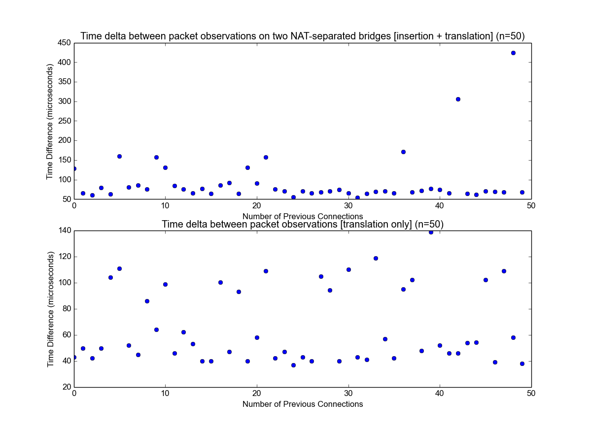
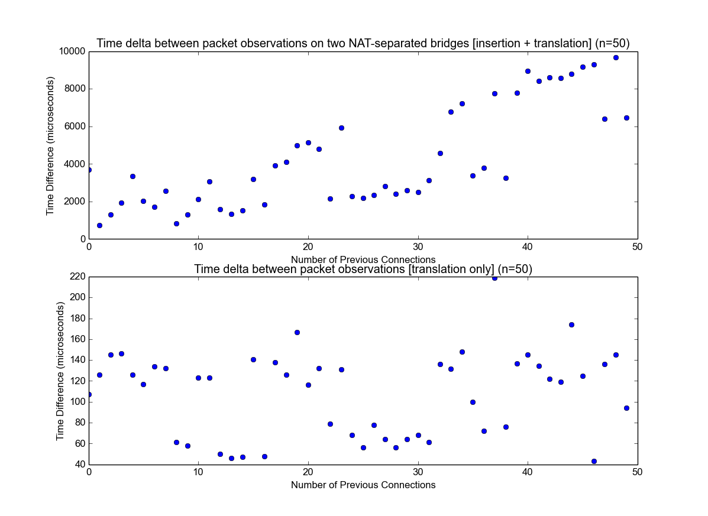

<!-- .slide: class="title" -->

# Persistent Networking with Irmin and MirageOS

Mindy Preston <small>University of Cambridge</small>
[@mindypreston](https://twitter.com/mindypreston)

_on behalf of:_ Magnus Skjegstad, Thomas Gazagnaire, Richard Mortier and Anil Madhavapeddy

[https://irmin.io](https://irmin.io)<br/>
[https://mirage.io](https://mirage.io)<br/>
[http://decks.openmirage.org/ocaml15-irminnet/](http://decks.openmirage.org/ocaml15-irminnet/)

<small>
  Press &lt;esc&gt; to view the slide index, and the &lt;arrow&gt; keys to
  navigate.
</small>


----

## "Network Datastores"

* 802.11 connection state
* ARP cache
* IP fragmentation/reassembly
* TCP connection state, seq/ack numbers, window status
* DNS cache
* DHCP client lease status
* upstream network: NAT table, DHCP server lease status, IDS/IPS, ...


----

## MirageOS + Irmin = <3


----

## Merges

```
$ git merge names
Auto-merging upnp.ml
CONFLICT (content): Merge conflict in upnp.ml
Automatic merge failed; fix conflicts and then commit the result.
$ grep -C2 ======= upnp.ml
<<<<<<< HEAD
    S.listen_udpv4 stack ~port:1901 output_packet;
=======
    S.listen_udpv4 stack ~port:1900 receive;
>>>>>>> names
```


## Example: ARP

A lookup table between `Macaddr.t` and `Ipaddr.V4.t` with expiration.

Multiple code paths to access the cache:

+ Packet processing
+ Expiration
+ Lookups from External Entities


## Order Doesn't Matter

+ Set some rules for conflicts & always return something

```
  let merge _path ~(old : Nat_table.Entry.t Irmin.Merge.promise) t1 t2 =        
    let winner =                                                                
      match compare t1 t2 with                                                  
      | n when n <= 0 -> t1                                                     
      | n -> t2                                                                 
    in                                                                          
    Irmin.Merge.OP.ok winner  
```


----

## Introspection/Editing with Git Tools

+ Flipping between in-memory and Git-backed FS:

```
module A_fs = Irmin_arp.Arp.Make(Irmin_unix.Irmin_git.FS)
module A_mem = Irmin_arp.Arp.Make(Irmin_mem.Make)   
module A = A_fs (* change to A_mem for in-memory store! *)
```


## Irmin-Arp in Action

* Virtual network of 10 nodes with ARP stacks sending TCP messages back and forth
* Git-FS backend for introspection and modification
* ARP:
  - initial broadcast
  - subsequent request/reply
  - entries expire after 60s


## NAT + ARP

* NAT: translate packets from one (src, dst) to another (src, dst)
* IPs change!


## Issues

* "the database that never forgets"
* access control
  * certificates and restricted channels to access the store are very coarse-grained


## Performance

* Run NATting unikernel on local Xen host across two virtual bridges (xenbr0, xenbr1) with 32MB of RAM
* Run a DNS server on xenbr0
* Run a client unikernel on xenbr1
* Client unikernel resolves a name using the DNS server on xenbr0


## Performance

* Measure time delta between packet arrival on xenbr0 and xenbr1
* DNS queries require table entry insertion; DNS responses only require a lookup


## MirageOS Hashtable NAT implementation:

+ max latency for lookup: ~140us
+ max latency for insertion: ~450us

<p class="center">
  
</p>


## MirageOS Irmin NAT implementation:

+ max latency for lookup: ~240us
+ max latency for insertion: ~25,000us (!)

<p class="center">
  
</p>


## Time to Reestablish Connections after NAT Reboot

+ much lower ;)


## Imagined Futures

+ Integration between XenStore and MirageOS unikernels


## Thanks!

+ Some of the research leading to these results has received funding from the European Union's Seventh Framework Programme FP7/2007-2013 under the UCN project, grant agreement no 611001.

