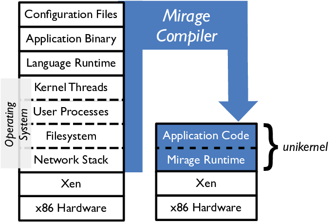
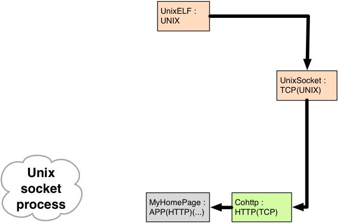
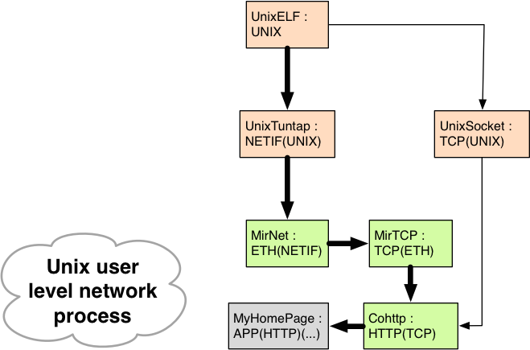
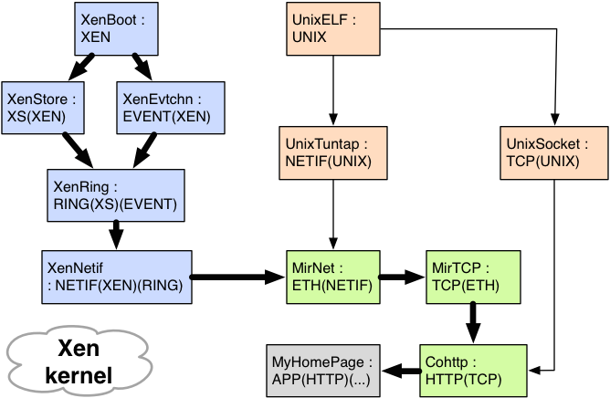

<!-- .slide: class="title" -->

# __[Nymote](http://nymote.org/)__: Git Your  **Own** Cloud Here

Anil Madhavapeddy <small>University of Cambridge</small>
[@avsm](http://twitter.com/avsm)

Richard Mortier <small>University of Nottingham</small>
[@mort\_\_\_](http://twitter.com/mort___)

[http://openmirage.org/](http://openmirage.org/) 
[http://nymote.org/](http://nymote.org/) 
[http://decks.openmirage.org/oscon14/](http://decks.openmirage.org/oscon14/#/)

<small>
  Press &lt;esc&gt; to view the slide index, and the &lt;arrow&gt; keys to
  navigate.
</small>

----

## Last year...

We introduced you to [Mirage OS Unikernels](http://openmirage.org/):

+ small, single-purpose networked appliances,

+ high-performance __and__ type-safe,

+ developed on Unix, deployed on Xen to the cloud.

In case you couldn't make that talk, a quick recap ...

## Cloud Stacks Suck!

Too many layers, too much duplication of functionality, e.g.,

+ Abstraction/Isolation
+ Scheduling
+ Memory management

Many people have now observed this, and are trying to fix it, e.g.,

+ Cloudius Systems' OSv (Java)
+ Galois' HalVM (Haskell)
+ Erlang-on-Xen (Erlang)

## It's All Just Code

Capture all system dependencies in code and compile them away.

  

## Retarget By Recompiling

Swap system libraries to target different platforms: 
**develop using native Unix**.

  

## Retarget By Recompiling

Swap system libraries to target different platforms: 
**test using Mirage system libraries**.

  

## Retarget By Recompiling

Swap system libraries to target different platforms: 
**deploy by building virtual machine image**.

  

## Mirage Unikernels

Mirage unikernels realise several benefits:

+ __Contained__, simplifying deployment and management.
+ __Compact__, reducing attack surface and boot times.
+ __Efficient__, able to fit 10,000s onto a single host.

 
That was last year...

<!-- .element: class="fragment" data-fragment-index="1" -->

----

## This year...

Thanks to an army of contributors, we'll show you how **we've improved Mirage's
multiscale programming support**.

As well as Unix and Xen, we can now target:

<!-- .element: class="fragment" data-fragment-index="1" -->

+ Small ARM-based systems, e.g., smartphones, Internet-of-Things;
+ Browsers, via compilation to JavaScript;
+ FreeBSD, via a kernel module backend.

<!-- .element: class="fragment" data-fragment-index="1" -->

We've also **added many new libraries**, including a Git-like distributed data
store, C foreign function interface, and a from-scratch OCaml TLS stack.

<!-- .element: class="fragment" data-fragment-index="2" -->

----

## Why? [nymote.org](http://nymote.org/)

We need to claim control over our online lives rather than abrogate it to
_The Cloud_:

+ Doing so means we **all** need to be able to run **our own infrastructure**.

+ **Without** having to become (Linux) **sysadmins**!

> 
How can we achieve this?

Mirage is the foundation for building **personal clouds**, securely
interconnecting and synchronising data between our devices.

<!-- .element: class="fragment" data-fragment-index="1" -->

----

## Introducing [Mirage OS 2.0](http://openmirage.org/)

These slides were written using Mirage on OSX:

- They are hosted in a **~6MB Xen unikernel written in statically type-safe
  OCaml**, including device drivers and network stack.

- Their application logic is just a **couple of source files**, written as a
  portable functor independent of OS dependencies.

- You are seeing them as a unikernel **running here on a CubieBoard2**, and they
  are also hosted **[on Amazon's EC2 public cloud](http://decks.openmirage.org/oscon14)**, with the binaries small
  enough to be tracked in Git.

## Even More Targets

  

## Even More Targets: ARM

  

## Even More Targets: JS

  

## Even More Targets: BSD

  

----

## Complexity Kills You

The enemy is **complexity**:

+ Applications are **deeply intertwined with system APIs**, and so lack
  portability.

+ Modern operating systems offer **dynamic support** for **many users** to run
  **multiple applications** simultaneously.

Almost **unbounded scope** for **uncontrolled interaction**! E.g.,

<!-- .element: class="fragment" data-fragment-index="1" -->

+ Choices of distribution and version.
+ Ad hoc application configuration under `/etc/`
+ Platform configuration details, e.g., firewalls.

<!-- .element: class="fragment" data-fragment-index="1" -->

## Multiscale Principles

Can we **disentangle applications from the operating system**?

- Break up core OS logic into modular libraries.

- Do not assume the presence of an ambient operating system kernel in
  application code.

- Target multiple platforms from a single development environment.

## Multiscale Programming

Can we disentangle applications from the operating system? **Yes**!

- **OCaml** gives us a **powerful module system** with **simple runtime
  semantics**.

- OS dependencies are broken down into modules, and reassembled by **functors**
  (functions from modules to modules).

- Applications become functors **across their dependencies** that result in a
  list of modules `mains : job impl list`.

- Compilation becomes a **staged specialization** process that continues until
  the target is output.

----

## Mirage OS 2.0 Workflow

As easy as 1&mdash;2&mdash;3!

1. Write your OCaml application using the Mirage module types
   + Express its configuration as OCaml code too!
2. Compile it under Unix using the `mirage` tool
   + Relies on the `opam` package manager to acquire dependencies via `make
     depend`
3. Once debugged, simply retarget it to Xen, and rebuild!
   + All the magic happens via the OCaml module system

## Modularizing the OS

  

## Modularizing the OS

  

## Modularizing the OS

  

----

## Orchestration

Unikernels are **small enough to be tracked in GitHub**. For example, for the
[Mirage website](http://openmirage.org/):

+ Updates are merged to **[mirage/mirage-www](https://github.com/mirage/mirage-www)**;

+ Repository is built by **[Travis-CI](https://travis-ci.org)**; if successful:

+ Output pushed to
  **[mirage/mirage-www-deployment](https://github.com/mirage/mirage-www-deployment)**;
  and our

+ Cloud toolstack spawns VMs based on pushes there.

**Our *entire* cloud-facing deployment is version-controlled from the source code
up**!

## Compiler in the Middle

  

## Compiler in the Middle

  

## Compiler in the Middle

  

## Compiler in the Middle

  

----

## Wrapping Up

Mirage OS 2.0 is an important step forward for multiscale programming,
supporting **more**, and **more diverse**, **backends** with much **greater modularity**.

For information about the many components we could not cover here, see
[the Mirage blog](http://openmirage.org/blog/):

+ __[Irmin](http://openmirage.org/blog/introducing-irmin)__, Git-like
  distributed branchable storage.
+ __[OCaml-TLS](http://openmirage.org/blog/introducing-ocaml-tls)__, a
  from-scratch native OCaml TLS stack.
+ __[Vchan](http://openmirage.org/blog/update-on-vchan)__, for low-latency
  inter-VM communication.
+ __[Ctypes](http://openmirage.org/blog/modular-foreign-function-bindings)__,
  modular foreign function bindings for linking _C_ libraries.

----

## <http://openmirage.org/>

Particular thanks to:
[Thomas Gazagnaire](http://gazagnaire.org/),
[David Kaloper](https://github.com/pqwy),
[Thomas Leonard](http://roscidus.com/blog/),
[Jon Ludlam](http://twitter.com/jonludlam),
[Hannes Mehnert](https://github.com/hannesm),
[Mindy Preston](https://github.com/yomimono),
[Dave Scott](http://dave.recoil.org/),
and [Jeremy Yallop](https://github.com/yallop).

  Thanks for listening! Questions?

  (_and please rate the talk_!)

