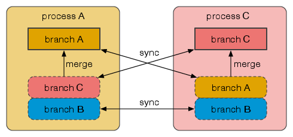
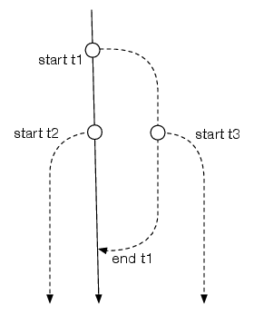
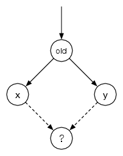
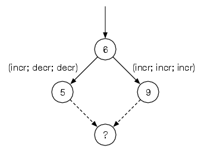
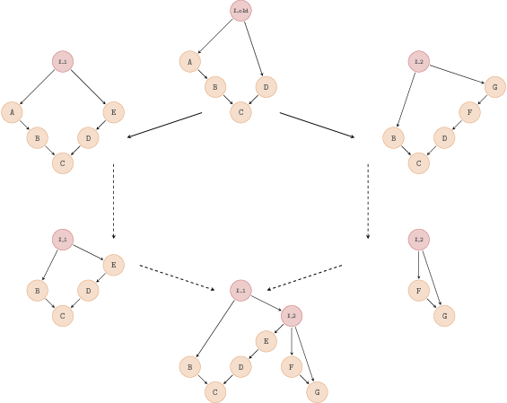
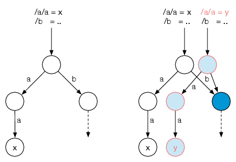
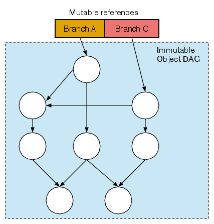

<!-- .slide: class="title" -->

# Irmin: a Git-like database library

Thomas Gazagnaire <small>University of Cambridge</small>
[@eriangazag](http://twitter.com/eriangazag)

**OUPS, Paris, Jan 2014**

[http://openmirage.org/](http://openmirage.org/)<br/>

[http://decks.openmirage.org/functionalconf14](http://decks.openmirage.org/functionalconf14/#/)

<small>
  Press &lt;esc&gt; to view the slide index, and the &lt;arrow&gt; keys to
  navigate.
</small>


----

## Summary

1. Distributed Systems (and Git)

3. Persistent data-structures (and Git)

4. Irmin (and Git)


----

# Distributed Systems (and Git)


## DVCS

(D)VCS are used by (almost) **all** software projects on the planet

- Huge open-source ecosystem (`tig`, `gitk`, ...)

- Very successful online hosting: https://github.com
    - 3.4M users
    - 16.7M projects


## DVCS

- Track history of changes:
    - In source files
    - Made by humans

- Distributed: no global state, every user has its own local state
    - Works offline

- Concurrent: multiple independent agents
    - Slow change rate

- Command-line tool

- Semi-automatic merges: users resolve conflicts manually


## DVC ~~S~~*D* (Database)

- Track history of changes
    - In ~~source file~~ *structured data*
    - Made by ~~humans~~ *applications*

- Distributed: no global state, every user has its own local state
    - Works offline

- Concurrent: *many* multiple independent agents
    - ~~Slow~~ *High* change rate

- ~~Command-line tool~~ *Library*

- ~~Semi-~~automatic merges


## DVCD

Branch consistency:

- A branch per process state
- Synchronization between branches
- Explicit and local merges

<p class="stretch center"></p>


## DVCD

Transactions:

- Record reads and writes
- A temporary branch per transaction
- Committing the transaction = merging the branch
- `EAGAIN` = conflict

<p class="stretch center"></p>


----

# Interlude: merges


## Yes, but what about merges?

- The nightmare of every Git user:

```
$ git merge X
Auto-merging <PATH>
CONFLICT (content): Merge conflict in <PATH>
Automatic merge failed; fix conflicts and then
commit the result.
```


## User-defined Merges

We resolve and deal with conflicts **progammatically**:

- The data in the database has a structure (i.e. a type)
- The merge functions are provided by the application developer
- Having the full history (eg. `git log`) helps *a lot*:
    - computation of the least common ancestor(s)
    - 3-way merge as in Git/Mercurial

<p class="stretch center"></p>


## User-defined Merges

```ocaml

module Merge: sig

  type 'a result = [ `Ok of 'a | `Conflict of string ]

  val ok: 'a -> 'a result
  val conflict: string -> 'a result
  val (>>|): 'a result -> ('a -> 'b result) -> 'b result

  type 'a t = old:'a -> 'a -> 'a -> 'a result

  val pair: 'a t -> 'b t -> ('a * 'b) t
  val set: (module Set.S with type t = 'a) -> 'a t
  val alist: ('a -> 'b option t) -> ('a * 'b) list t

end
```


## User-defined Merges

```ocaml

module type Contents: sig
  type t
  val read: Mstruct.t -> t
  val write: t -> Cstruct.t -> Cstruct.t
  [..]

  type path
  val merge: path -> t option Merge.t
end
```


## User-defined Merges

Distributed counters:

<p class="stretch center"></p>

```ocaml
module Counter = struct
  type t = int
  let incr i = i+1
  let decr i = 1-1

  let merge _path ~old x y = ok (x + y - old)
end
```


## User-defined Merges

A more complex example: Mergeable Queues [JFLA'15]

<p class="stretch center"></p>


----

# Persistent Data-structures (and Git)


## Okasaki

Purely functional data-structures

- structures are immutable
- share substructures when possible: allow to have multiple versions
  of a structure with reasonable space usage

<p class="stretch center"></p>

- the Bible: Okasaki (lots of useful data-structures)


## Git Data-structures

Git Blobs

- raw user-contents
- filename is the hash of the contents
    - deduplication, implicit hash-consing

```ocaml
type t = string

let write blob =
  let key = SHA1.digest blob in
  let oc = open_out (filename key) in
  (* [filename x] is `.git/objects/<hash(x)>` *)
  output_string oc (compress blob)
```


## Git Data-structures

Git Trees

- model the filesystem
- filename is the hash of the marshaled tree
    - use the hash of blobs (leafs) and other tree (sub-nodes)
    - deduplication, implicit hash-consing
    - implicit immutable prefix-tree

```ocaml
type entry = {
  perm: [`Normal | `Exec | `Dir | ..];
  name: string;
  node: SHA1.t;
}
type t = entry list
```


## Git Data-structures

Git Commits

- model the history
- filename is the hash of the marshaled commit
    - use the hash of trees (contents) and other commits (parents)
    - deduplication, implicit hash-consing
    - implicit immutable partial-order (Hasse diagramm)

```ocaml
type t = {
  tree     : SHA.Tree.t;
  parents  : SHA.Commit.t list;
  author   : User.t;
  committer: User.t;
  message  : string;
}
```


## Git Data-structures

Git references

- The tip of each branch is kept in a mutable store

- The name of the current branch:
```
$ cat .git/HEAD
ref: refs/heads/master
```

- The hash of the corresponding commit:
```
$ cat .git/refs/heads/master
dba4f04b8cc9ad418e745b287d2d690e170fa0af
```


## Git Data-structures + Irmin merges

- Git exposes immutable datastructures
- Irmin uses user-defined merge functions
- Local mutable state is kept in a (small) local store

<p class="stretch center"></p>


----

# Irmin


## Irmin Highlights

- On-disk format fully compatible with the Git format
    - Full log of read/write access to the database
    - Usual Git tools works for auditing

- classical REST API
    - Easy to build new Javascript UI
    - Easy to integrate with 3-tiers applications

- Very portable
    - Run with Mirage
    - Can run directly inside the browser


## Irmin backends

Append-only backends to store objects
```ocaml
module type AO_MAKER =
  functor (K: Hash.S) ->
  functor (V: Tc.S0) -> sig
    type t
    type key = K.t
    type value = V.t
    val create: config -> ('a -> task) -> ('a -> t)
    val read: t -> key -> value option
    val mem: t -> key -> bool
    val add: t -> value -> key
end
```


## Irmin backends

Read-write backends to store references

```ocaml
module type RW_MAKER =
  functor (K: Hum.S) ->
  functor (V: Hash.S) ->
    type t
    type key = K.t
    type value = V.t
    val create: config -> ('a -> task) -> ('a -> t)
    val read: t -> key -> value option
    val mem: t -> key -> bool
    val update: t -> key -> value -> unit
    val remove: t -> key -> unit
end

```


## Irmin backends

Current:

- In-memory
- Git
- Bin_prot
- HTTP REST client
- `Obj`

Future:

- Encryption proxy
- DHT
- DNS


## OCaml-git

ocaml-git (Git formats and protocols in pure OCaml):

- last release in `opam`: 1.4.5
    - support serialization of all Git objects (including pack files)
    - support fetch/push client protocols
       (`git://`, `git+ssh` and smart HTTP)

- missing
    - compression of pack files (and `git gc`)
    - server-side protocols


## Imin

- last release in `opam`: 0.9.2
- 1.0.0 should be available at the end of the month
    - with full integration with Mirage
    - proper documentation for the REST API


## Users

- [Xenstore + Irmin](https://www.youtube.com/watch?v=DSzvFwIVm5s) (Citrix)

- Version Controlled IMAP server (demo available):
```
opam install imaplet-lwt
```

- Distributed Logs (pre-pre-alpha): https://github.com/samoht/dog

- You?


----

# Thanks for your attention!

Questions?