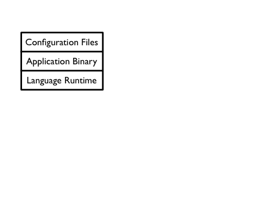
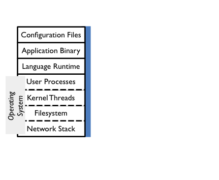
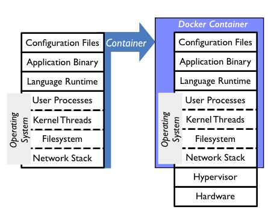

<!-- .slide: class="title" -->

# Unikernels: The Next Million Operating Systems

Anil Madhavapeddy<small>University of Cambridge</small>
[@avsm](http://twitter.com/avsm)

[https://mirage.io/](http://openmirage.org/) 
[http://decks.openmirage.org/qcon15-unik/](http://decks.openmirage.org/qcon15-unik/)

<small>
  Press &lt;esc&gt; to view the slide index, and the &lt;arrow&gt; keys to
  navigate
</small>

----

## The Modern OS

> Operating systems are traditionally designed to run on a wide range of hardware, and 
> support a variety of applications.

 
This role is under attack from both sides:

- Hypervisors in the cloud provides **virtual hardware** abstractions
- Many modern applications are single purpose **microservices**

## Application Logic

  

## ...over operating systems

  

## ...to cloud deployment

  

## Dev Ops Pain

  
These layers all add up to:

  <ul>
    <li>**Complex** configuration management</li>
    <li>Duplication leads to **inefficiency**</li>
    <li>Image size leads to **long boot times**</li>
    <li>All the layers leads to **large attack surface**</li>
  </ul>

  
   <small>
    https://flic.kr/p/8N1hWh
  </small>

## Why is this stack sacred?

  

## Unikernels

  

## The Unikernel Approach

> __Unikernels__ are specialised virtual machine images compiled from a
> modular stack of application code, system libraries and configuration

 
This means they realise several benefits:
<!-- .element: class="fragment" data-fragment-index="2" -->

+ __Contained__, simplifying deployment and management
+ __Compact__, reducing attack surface and boot times
+ __Efficient__, able to fit 10,000s onto a single host
+ __Portable__, to many compilation environments beyond Xen

<!-- .element: class="fragment" data-fragment-index="2" -->

## Application First

With unikernels, the operating system disappears and becomes
a set of libraries linked against a boot loader.

* Application can figure out which components it needs
* Libraries can easily be customised (e.g. TCP/IP stack)
* Profiling and tracing work in a single domain.
* Replace C libraries with type-safe equivalents!

> Every application is compiled into its own specialised
> operating system that runs on the cloud.

## Tradeoffs

  
**Good for:**

  <ul>
    <li>Specialising microservice endpoint APIs</li>
    <li>Flash traffic resilience with real-time spawning</li>
    <li>Mobile/embedded environments as well as cloud</li>
  </ul>

  
**Bad for:**

  <ul>
    <li>Monolithic application stacks that are hard to break up</li>
    <li>Graphical user interfaces with deep OS requirements</li>
    <li>Multi-user interaction within a single microservice</li>
  </ul>

