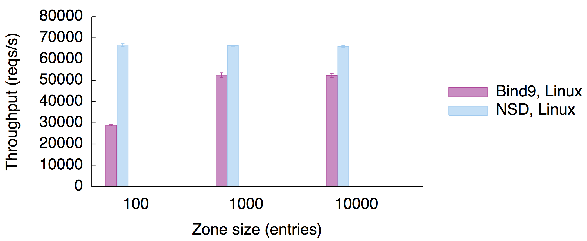
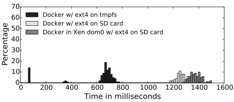

<!-- .slide: class="title" -->

# Git Your Own Cloud:<br>Summoning Unikernels

Richard Mortier <small>University of Nottingham^WCambridge</small>
[@mort\_\_\_](http://twitter.com/mort___)

_on behalf of a merry crew:_ Anil Madhavapeddy, <br>
Thomas Gazagnaire, David Scott, Thomas Leonard, <br>
Magnus Skjegstad, David Sheets, Amir Chaudhry, <br>
Jon Crowcroft, Balraj Singh, Mindy Preston

[http://openmirage.org/](http://openmirage.org/)<br/>
[http://decks.openmirage.org/uw14-seminar/](http://decks.openmirage.org/uw14-seminar/)

<small>
  Press &lt;esc&gt; to view the slide index, and the &lt;arrow&gt; keys to
  navigate
</small>


----

## Introducing [Mirage OS 2.0](http://openmirage.org/)

These slides were written using Mirage on Mac OSX:

- They are hosted in a **2.5MB Xen unikernel** written in statically type-safe
  OCaml, including device drivers and network stack
  - Including all content encoded as an OCaml string, 7.2MB

- Their application logic is just a **couple of source files**, written
  independently of any OS dependencies

- Running on an **ARM** CubieBoard2, and hosted on the cloud

- Binaries small enough to track the **entire deployment** in Git!


## Introducing [Mirage OS 2.0](http://openmirage.org/)

<p class="stretch center">
  
</p>


## Cubieboard 2 (&pound;39)

+ AllWinnerTech SOC A20, ARM Cortex-A7 Dual-Core
+ GPU: ARM Mali400 MP2 (OpenGL ES 2.0/1.1)
+ 1GB DDR3, 3.4GB internal NAND flash
+ 10/100 ethernet, support USB WiFi
+ 2x USB 2.0 HOST, mini USB 2.0 OTG, micro SD, SATA
+ HDMI 1080P display output
+ IR, line in, line out, 96 extend PIN interface, including I2C, SPI, RGB/LVDS,
  CSI/TS, FM-IN, ADC, CVBS, VGA, SPDIF-OUT, R-TP, and more


----

## Systems Programming

> It's considered good programming practice to focus on compositionality: build
> software out of small, well-defined modules that combine to give rise to other
> modules with different behaviors.

> **This is simply too difficult to do in distributed systems. Why?**

&nbsp; &nbsp; &nbsp; &nbsp; &nbsp; &nbsp; &nbsp; &nbsp; &nbsp; &nbsp;
*&mdash; Marius Eriksen, Principal Engineer, Twitter*
*([source](http://monkey.org/~marius/sosp13.html))*


## From simple servers...

Traditional systems programming has involved building services in *one*
environment, e.g. Server, client, or embedded


##  ...To deep-sea diving

Traditional systems programming has involved building services in *one*
environment but a modern programmer deals with diverse targets:

- **Cloud services** with unpredictable traffic spikes and failures
- **Smartphone programming** on ARM/x86 with power budgets
- **JavaScript** user interfaces with asynchronous web clients
- **Internet of Things** devices that have little ARM M0 processors
- **Kernel modules** to extend operating system functionality

> No (little) code reuse between platforms


## The IoT Spring

<p class="center stretch">
  
</p>


## Recently...

* **Heartbleed**: 17% of *all* Internet secure web servers vulnerable to a
  single bug, described as "catastrophic" by Bruce Schneier
* **ShellShock**: CGI, Web, DHCP all vulnerable to code execution. Millions of
  sites potentially vulnerable
* **JP Morgan**: 76 million homes and 8 million small businesses exposed in a
  single data breach
* **Target**: 40 million credit cards stolen electronically

> System security is in a disastrous state, and improving only slowly, at much
> cost!


## Complexity Kills You

The enemy is **complexity**:

+ Applications are **deeply intertwined** with system APIs, and so lack
  portability
+ Modern operating systems offer **dynamic support** for **many users** to run
  **multiple applications** simultaneously

Almost unbounded scope for uncontrolled interaction!

+ Choices of distribution and version
+ Ad hoc application configuration under `/etc/`
+ Platform configuration details, e.g., firewalls


## Leaning Tower of Cloud

<div class="left" style="width: 65%">
  <p>Numerous pain points:</p>
  <ul>
    <li>**Complex** configuration management</li>
    <li>Duplicated functionality leads to **inefficiency**</li>
    <li>VM image size leads to **long boot times**</li>
    <li>Lots of code means a **large attack surface**</li>
  </ul>
</div>

<p class="right">
  
  <br /><small>
    https://flic.kr/p/8N1hWh
  </small>
</p>


## Docker: Containerisation

<p class="stretch center">
  
</p>

<p class="right">
  <small>
    https://flic.kr/p/qSbck
  </small>
</p>


## Docker: Containerisation

Docker bundles up all this state making it easy to transport, install and manage

<p class="stretch center">
  
</p>


## Can We Do Better?

**We need to disentangle applications from the operating system**:

- Break up operating system functionality into modular libraries
- Link only the system functionality your app needs
- Target alternative platforms from a single codebase


----

## The Unikernel Approach

> __Unikernels__ are specialised virtual machine images compiled from the full
> stack of application code, system libraries and configuration

<br/>
This means they realise several benefits:
<!-- .element: class="fragment" data-fragment-index="2" -->

+ __Contained__, simplifying deployment and management
+ __Compact__, reducing attack surface and boot times
+ __Efficient__, able to fit 10,000s onto a single host

<!-- .element: class="fragment" data-fragment-index="2" -->


## It's All Functional Code

Capture system dependencies in code and compile them away<br/>
<span class="right" style="width: 15em">
  &nbsp;
</span>

<p class="stretch center">
  
</p>


## Retarget By Recompiling

Swap system libraries to target different platforms:<br/>
<span class="right">**develop application logic using native Unix**</span>

<p class="stretch center">
  
</p>


## Retarget By Recompiling

Swap system libraries to target different platforms:<br/>
<span class="right">**test unikernel using Mirage system libraries**</span>

<p class="stretch center">
  
</p>


## Retarget By Recompiling

Swap system libraries to target different platforms:<br/>
<span class="right">**deploy by specialising unikernel to Xen**</span>

<p class="stretch center">
  
</p>


## Retarget By Recompiling

Swap system libraries to target different platforms:<br/>
<span class="right">**...which provides a stable hardware interface**</span>

<p class="stretch center">
  
</p>


## Mirage OS 2.0 Workflow

As easy as 1&mdash;2&mdash;3!

1. Write your OCaml application using the Mirage module types, expressing its
   configuration as OCaml code too!
```
$ mirage configure app/config.ml --unix
```


## Mirage OS 2.0 Workflow

As easy as 1&mdash;2&mdash;3!

1. Write your OCaml application using the Mirage module types, expressing its
   configuration as OCaml code too!

2. Compile it and debug under Unix using the `mirage` tool
```
$ cd app
$ make depend # install library dependencies
$ make build  # build the unikernel
```


## Mirage OS 2.0 Workflow

As easy as 1&mdash;2&mdash;3!

1. Write your OCaml application using the Mirage module types, expressing its
   configuration as OCaml code too!

2. Compile it and debug under Unix using the `mirage` tool

3. Once debugged, simply retarget it to Xen, and rebuild!
```
$ mirage configure app/config.ml --xen
$ cd app && make depend && make build
```

All the magic happens via the OCaml module system


----

## Modularity is Good

Mirage OS restructures all system components as __modules__:

1. A collection of __module types__, describing the structural "shapes" of the
   components of an operating system (e.g., device drivers)

2. A collection of independent __libraries implementing those module types__

As with all library OSs, only the required libraries are linked


## Modular to the max

Modules are used everywhere in Mirage to describe OS layers:

- For the __whole application/OS__: we've a full implementation of the network
  stack (including TLS) in OCaml

- Very __flexible approach__ for customising OS stacks for weird applications
  (e.g., HTTP over UPnP over UDP)

- Lots of __separate implementations__ of the module signatures: Unix, Xen
  microkernels, JavaScript, kernel modules, ...


## Writing a component

A Mirage component usually contains

+ a module that __implements a specific module type__,
+ having __very limited dependencies__ (typically on just the Mirage module
  types)

In OCaml, modules can be abstracted over other modules:

- ML calls such modules __functors__
- Functors are a type-safe version of C++ templates


## Module Types: Devices

```
module type DEVICE = sig

  type +'a io
  type t
  type id

  val id : t -> id

  val connect: id -> [ `Error of exn | `Ok of t ] io

  val disconnect : t -> unit io

end
```

Generic interface to any device driver...


## Module Types: Flows

```
module type FLOW = sig

  type +'a io
  type buffer
  type flow

  val read : flow -> [`Ok of buffer | `Eof | `Error of exn ] io

  val write : flow -> buffer -> [`Ok of unit | `Eof | `Error of exn ] io

  val writev : flow -> buffer list -> [`Ok of unit | `Eof | `Error of exn ] io

end
```

...or IO flow


## Module Types: Inclusion

```
module type TCPV4 = sig

  type buffer
  type ipv4
  type ipv4addr
  type flow

  include DEVICE with
  with type id := ipv4

  include FLOW with
  with type 'a io  := 'a io
  and  type buffer := buffer
  and  type flow   := flow
```

...and they can be composed together into other module types, avoiding the
diamond problem


## Module Types: Entropy

```
module type ENTROPY = sig

  include DEVICE
  type buffer

  type handler = source:int -> buffer -> unit
  (** A [handler] is called whenever the system has extra entropy to announce.
   * No guarantees are made about the entropy itself, other than it being
   * environmentally derived. In particular, the amount of entropy in the buffer
   * can be far lower than the size of the [buffer].
   *
   * [source] is a small integer, describing the provider but with no other
   * meaning.
   **)

  val handler : t -> handler -> unit io
end
```

Complex driver models can be expressed abstractly (see
[V1.ml](https://github.com/mirage/mirage/tree/master/types/))


## Module Types: Refinement

```
module type FLOW = FLOW
  with type 'a io = 'a Lwt.t
   and type buffer = Cstruct.t

module type NETWORK = NETWORK
  with type 'a io = 'a Lwt.t
   and type page_aligned_buffer = Io_page.t
   and type buffer = Cstruct.t
   and type macaddr = Macaddr.t

module type ETHIF = ETHIF
  with type 'a io = 'a Lwt.t
   and type buffer = Cstruct.t
   and type macaddr = Macaddr.t
   and type ipv4addr = Ipaddr.V4.t
```

The abstract types are specialised into concrete library types for common uses
(see [V1_LWT.ml](https://github.com/mirage/mirage/tree/master/types/))


----

## Writing a component

A Mirage component usually contains:

- Code parameterised by functors with very limited (Mirage-only) dependencies,
  and particularly __no OS dependencies__

- A collection of libraries where the functors are (fully or partially) applied,
  suitable for interactive use

> Functors clearly separate dependencies between OS components, breaking
> the monolithic OS down into components


## Modularizing the OS

<p class="stretch center">
  
</p>


## Modularizing the OS

<p class="stretch center">
  
</p>


## Modularizing the OS

<p class="stretch center">
  
</p>


## Example: A Website

```
module Main (C:CONSOLE) (FS:KV_RO) (H:HTTP.Server) = struct

  let start c fs http =
    ...

    let callback conn_id request body =
      C.log "HTTP request received" ...
      >>= fun () ->
      let uri = H.Request.uri request in
      dispatcher (split_path uri)
    in
    let conn_closed (_,conn_id) () = ...  in
    http { H.callback; conn_closed }

end
```


## Configuration EDSL

Your web server is just an OCaml function:

```
let server =
  let conduit = conduit_direct (stack default_console) in
  http_server (`TCP (`Port 80)) conduit

let main = foreign "Dispatch.Main"
  (console @-> kv_ro @-> http @-> job)

let () =
  register "www" [ main $ default_console $ fs $ server ]
```

The configuration is evaluated at compilation time to generate a main entry
point for that _particular_ setup


## Correspondence

Configuration Code:

```
let server =
  let conduit = conduit_direct (stack default_console) in
  http_server (`TCP (`Port 80)) conduit

let main = foreign "Dispatch.Main"
  (console @-> kv_ro @-> http @-> job)
```

Application Code:

```
module Main (C:CONSOLE) (FS:KV_RO) (H:HTTP.Server) = struct

  let start c fs http = ...
```


## Correspondence: Unix

```
module Stackv41 = Tcpip_stack_socket.Make(Console)
module Conduit1 = Conduit_mirage.Make(Stackv41)
module Http1 = HTTP.Make(Conduit1)
module M1 = Dispatch.Main(Console)(Static1)(Http1.Server)
```

Fairly simple application where:

+ A kernel socket `C` binding, `Tcpip_stack_socket`, takes...
+ A `Console` to build...
+ A network stack, `Stackv41`, over which we instantiate...
+ An `HTTP` server

...which is finally passed to the application (along with a static filesystem
and a console)


## Correspondence: Xen

In Xen, we build the network stack "by hand" starting with the Ethernet device,
as we have no kernel sockets

```
module Stackv41 = struct
  module E = Ethif.Make(Netif)
  module I = Ipv4.Make(E)
  module U = Udpv4.Make(I)
  module T = Tcpv4.Flow.Make(I)(OS.Time)(Clock)(Random)
  module S = Tcpip_stack_direct.Make(Console)(OS.Time)(Random)(Netif)(E)(I)(U)(T)
  include S
end
module Conduit1 = Conduit_mirage.Make(Stackv41)
module Http1 = HTTP.Make(Conduit1)
module M1 = Dispatch.Main(Console)(Static1)(Http1.Server)

...

let () =
  OS.Main.run (join [t1 ()])
```


----

## End Result?

Unikernels are compact enough to boot and respond to network traffic in
real-time

<table style="border-bottom: 1px black solid">
  <thead style="font-weight: bold">
    <td style="border-bottom: 1px black solid; width: 15em">Appliance</td>
    <td style="border-bottom: 1px black solid">Standard Build</td>
    <td style="border-bottom: 1px black solid">Dead Code Elimination</td>
  </thead>
  <tbody>
    <tr style="background-color: rgba(0, 0, 1, 0.2)">
      <td>DNS</td><td>0.449 MB</td><td>0.184 MB</td>
    </tr>
    <tr>
      <td>Web Server</td><td>0.674 MB</td><td>0.172 MB</td>
    </tr>
    <tr style="background-color: rgba(0, 0, 1, 0.2)">
      <td>Openflow learning switch</td><td>0.393 MB</td><td>0.164 MB</td>
    </tr>
    <tr>
      <td>Openflow controller</td><td>0.392 MB</td><td>0.168 MB</td>
    </tr>
  </tbody>
</table>


## End Result?

Unikernels are compact enough to boot and respond to network traffic in
real-time

<p class="stretch center">
  
</p>


## Macrobenchmarks

Type-safety in the application layer defeats several external threats, but at
what cost in the kernel?

We have implemented several larger appliances:

+ a simple webserver
+ an OpenFlow Switch
+ an OpenFlow Controller


## DNS Server <small>baseline</small>

<p class="stretch center">
  
</p>

_Baseline figures, running __Bind__ (standard) and __NSD__ (high performance).
NSD achieves around 70 kreqs/s_


## DNS Server <small>mirage</small>

<p class="stretch center">
  
</p>

_Comparing against __Mirage__ appliance, with and without simple memoisation:
this __algorithmic__ optimisation added just 6 lines of code_


## DNS Server <small>C/miniOS</small>

<p class="stretch center">
  
</p>

_A simple `C` appliance linked NSD directly against MiniOS but poor
user-space library performance vastly outweighs language effects_


## Scaling <small>via Parallel Instances</small>

<p class="stretch center">
  
</p>

_Static page request throughput: Mirage scales by running many instances rather
than paying for thread-level interlocking_


## Openflow Controller

<p class="stretch center">
  
</p>

_Competitive with NOX (C++) but much higher level, and both switch and controller
can be linked as libraries_


----

## Faster than light?

Many network services suffer as _latency_ increases, e.g.,

+ Siri
+ Google Glass

...to say nothing of how they operate when disconnected

> So let's move the computation closer to the data

<!-- .element: class="fragment" data-fragment-index="1" -->


## Stronger than steel?

We earlier noted the many recent network security problems:

+ Heartbleed
+ Shellshock

...and such bugs will reoccur, now in our homes, cars, fridges

> So let's interpose network protection

<!-- .element: class="fragment" data-fragment-index="1" -->


## Jitsu!

> __Just-in-Time Summoning of Unikernels__

A toolstack to launch unikernels on-demand with negligible latency:

+ __Performance improvements__ to Xen's boot process & toolstack
+ __Conduit__, shared-memory communication between unikernels
+ __Synjitsu__ and the Jitsu Directory Service


## Jitsu Architecture

<p class="center stretch">
  
</p>


## Xen/ARM Toolstack

+ Removal of `libc` reduces attack surface and image size
  + Did need to add floating point formatting routines back, copied from `musl`
  `libc`
+ Xen PV driver model only &ndash; no hardware emulation
  + ARM does not need all the legacy support of Xen/x86
+ Deserialising device attachment and boot transactions
  + Custom merge function in the OCaml XenStore implementation reduces spurious
    conflicts during boot
  + The backend runs _dom0_ `VIF` hotplug scripts in parallel with the domain
    builder


## Deserialisation

<div>
  <div style="max-width:50%" class="left stretch">
    
  </div>
  <div style="max-width:49%" class="right">
    
  </div>
</div>

_Improving XenStore parallelism addresses scaling problems, and optimising boot
process dramatically reduces boot time_


## Conduit

+ Establishes __zero-copy shared-memory__ pages between peers
  + Xen grant tables map pages between VMs (`/dev/gntmap`), synchronised via
    event channels (`/dev/evtchn`)
+ Provides a __rendezvous facility__ for VMs to discover named peers
  + Also supports unikernel and legacy VM rendezvous
+ Hooks into higher-level __name services__ like DNS

+ Compatible with the __`vchan`__ inter-VM communication protocol


## Rendezvous

<div>
  <div style="max-width:58%" class="left">
    <ul>
      <li>XenStore acts as an incoming connection queue</li>
      <li>
        Callbacks are registered on a new `/conduit/server=domid/listen` subtree
      </li>
      <li>
        Client picks port and writes to `listen` queue
      </li>
      <li>
        Connection metadata (grant table, event channel refs) is written into
        `/local/domain/domid/vchan`
      </li>
    </ul>
    <p>...and the data flows</p>
  </div>
  <div style="max-width:40%" class="right">
    
  </div>
</div>


## Jitsu Directory Service

Performs the role of Unix's `inetd`:

+ Jitsu VM launches at boot time to handle name resolution (whether local via
  a well known `jitsud` Conduit node in XenStore or remote via DNS)

+ When a request arrives for a live unikernel, Jitsu returns the appropriate
  endpoint

+ If the unikernel is not live, Jitsu boots it, and acts as proxy until the
  unikernel is ready


## Masking boot latency

<p class="center stretch">
  
</p>

_By buffering TCP requests into XenStore and then replaying, Synjitsu
parallelises connection setup and unikernel boot_


## Masking boot latency

<div style="max-width:49%" class="left">
  <p>
    Jitsu optimisations bring boot latency down to __~350&mdash;400 ms__
  </p>
  <ul>
    <li>
      Docker time was 1.1s (Linux), 1.2s (Xen) from an SD card
    </li>

    <li>
      Mounting Docker's volumes on an `ext4` loopback volume inside of a `tmpfs`
      reduced latency but often terminated early due to many buffer IO, `ext4`
      and `VFS` errors
    </li>
  </ul>
</div>

<div style="max-width:48%" class="right">
  
  
</div>


----

## Git Your Own Cloud

Unikernels are **small enough to be tracked in GitHub**. For example, for the
[Mirage website](http://openmirage.org/):

1. Source code updates are merged to
   **[mirage/mirage-www](https://github.com/mirage/mirage-www)**;

2. Repository is continuously rebuilt by
   **[Travis CI](https://travis-ci.org/mirage/mirage-www)**; if successful:

3. Unikernel pushed to   **[mirage/mirage-www-deployment](https://github.com/mirage/mirage-www-deployment)**

4. Cloud toolstack spawns VMs based on pushes there.

**Our *entire* cloud-facing deployment is version-controlled from the source
code up**!


## Implications

**Historical tracking of source code and built binaries in Git(hub)**

+ `git tag` to link code and binary across repositories
+ `git log` to view deployment changelog
+ `git pull` to deploy new version
+ `git checkout` to go back in time to any point
+ `git bisect` to pin down deployment failures


## Implications

Historical tracking of source code and built binaries in Git(hub)

**Low latency deployment of security updates**

+ No need for Linux distro to pick up and build the new version
+ Updated binary automatically built and pushed
+ Pick up latest binary directly from repository
+ Statically type-checked language prevents classes of attack


## Implications

Historical tracking of source code and built binaries in Git(hub)

Low latency deployment of security updates

**Unified development for cloud and embedded environments**

+ Write application code once
+ Recompile to swap in different versions of system libraries
+ Use compiler optimisations for exotic environments


## Implications

Historical tracking of source code and built binaries in Git(hub)

Low latency deployment of security updates

Unified development for cloud and embedded environments

**Highly responsive deployment to support legacy services**

+ DNS server interprets (e.g.) `git-commit-ref.service.name`
+ Checks out appropriate unikernel revision
+ x86 boots in 20&mdash;30ms while Synjitsu proxies TCP handshake
+ Conduit channels created, allowing (per-client?) unikernel to protect legacy VM


----

## Ongoing Stuff

Mirage OS 2.0 is an important step forward, supporting **more**, and **more
diverse**, **backends** with much **greater modularity**.

For information about the many components we could not cover here, see
[openmirage.org](http://openmirage.org/blog/):

+ __[Irmin](http://openmirage.org/blog/introducing-irmin)__, Git-like
  distributed branchable storage
+ __[OCaml-TLS](http://openmirage.org/blog/introducing-ocaml-tls)__, a
  from-scratch native OCaml TLS stack
+ __[Ctypes](http://openmirage.org/blog/modular-foreign-function-bindings)__,
  modular C foreign function bindings
+ __[Profiling](http://roscidus.com/blog/blog/2014/10/27/visualising-an-asynchronous-monad/)__
  via a visualisation tool


## Get Involved!

Unikernels are an incredibly interesting way to code functionally at scale.
Nothing stresses a toolchain like building a whole OS.

- **Choices**: [Mirage OS](http://openmirage.org) in OCaml,
  [HaLVM](http://halvm.org) in Haskell, Rump Kernels or OSv for compatibility,
  ClickOS for routing.
- **Scenarios**: Static websites, dynamic content, custom routers.
- **Performance**: There's no hiding behind abstractions. HalVM *vs* Mirage is a
  fun contest in evaluating abstraction cost.

> Most important: need contributors to build the library base of safe protocol
> implementations (TLS has been done!)


## Why? [nymote.org](http://nymote.org/)

We need to claim control over our online lives rather than abrogate it to
_The Cloud_:

+ Doing so means we **all** need to be able to run **our own infrastructure**
+ **Without** having to become (Linux) **sysadmins**!
+ How can we achieve this?

> Mirage/ARM is the foundation for building **personal clouds**, securely
> interconnecting and synchronising our devices.

<!-- .element: class="fragment" data-fragment-index="1" -->


## <http://openmirage.org/>

A Linux Foundation Incubator Project lead from the University of Cambridge and
Citrix Systems.

Featuring blog posts on new features by:

[Amir Chaudhry](http://amirchaudhry.com/),
[Thomas Gazagnaire](http://gazagnaire.org/),
[David Kaloper](https://github.com/pqwy),
[Thomas Leonard](http://roscidus.com/blog/),
[Jon Ludlam](http://twitter.com/jonludlam),
[Hannes Mehnert](https://github.com/hannesm),
[Mindy Preston](https://github.com/yomimono),
[Dave Scott](http://dave.recoil.org/),
and [Jeremy Yallop](https://github.com/yallop).

<p style="font-size: 40px; font-weight: bold;
          display: float; padding: 2ex 0; text-align: center">
  Thanks for listening! Questions?
  <br />
  Contributions very welcome at [openmirage.org](http://openmirage.org)
  <br />
  Mailing list at <mirageos-devel@lists.xenproject.org>
</p>
