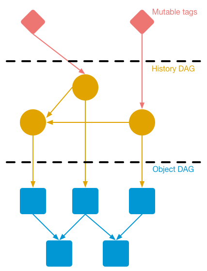
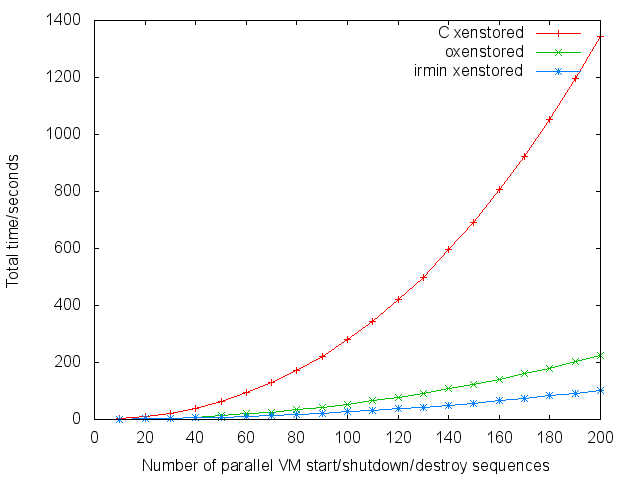

<!-- .slide: class="title" -->

# __MirageOS 2.0__: Branch consistency for Xen Stub Domains

Dave Scott <small>Citrix Systems</small> [@mugofsoup](http://twitter.com/mugofsoup)<br />
Thomas Gazagnaire <small>University of Cambridge</small> [@eriangazag](http://twitter.com/eriangazag)<br />
Anil Madhavapeddy <small>University of Cambridge</small> [@avsm](http://twitter.com/avsm)<br />

[http://openmirage.org](http://openmirage.org)<br />
[http://decks.openmirage.org/xendevsummit14/](http://decks.openmirage.org/xendevsummit14/#/)

<small>
  Press &lt;esc&gt; to view the slide index, and the &lt;arrow&gt; keys to
  navigate.
</small>


----

## Introducing [Mirage OS 2.0](http://openmirage.org/)

These slides were written using Mirage on OSX:

- They are hosted in a **938kB Xen unikernel** written in statically type-safe
  OCaml, including device drivers and network stack.

- Their application logic is just a **couple of source files**, written
  independently of any OS dependencies.

- Running on an **ARM** CubieBoard2, and hosted on the cloud.

- Binaries small enough to track the **entire deployment** in Git!


## Introducing [Mirage OS 2.0](http://openmirage.org/)

<p class="stretch center">
  
</p>


## New Features in 2.0

Mirage OS 2.0 is an important step forward, supporting **more**, and **more
diverse**, **backends** with much **greater modularity**.

For information about the new components we cannot cover here, see
[openmirage.org](http://openmirage.org/blog/):

+ __[Xen/ARM](http://openmirage.org/blog/introducing-xen-minios-arm)__, for
  running unikernels on embedded devices	.
+ __[Irmin](http://openmirage.org/blog/introducing-irmin)__, Git-like
  distributed branchable storage.
+ __[OCaml-TLS](http://openmirage.org/blog/introducing-ocaml-tls)__, a
  from-scratch native OCaml TLS stack.
+ __[Vchan](http://openmirage.org/blog/update-on-vchan)__, for low-latency
  inter-VM communication.
+ __[Ctypes](http://openmirage.org/blog/modular-foreign-function-bindings)__,
  modular C foreign function bindings.


## This Xen Dev Summit talk

We focus on how we have been using Mirage to:

- __improve the core Xenstore toolstack__ using Irmin.
- a performance and distribution future for __Xenstore__.
- plans for __upstreaming__ our patches.

<br/>
But first, some background...


----

## Irmin:  Mirage 2.0 Storage

**Irmin** is our *library database* that follows the modular
design principles of MirageOS: <https://github.com/mirage/irmin>

- Runs in both **userspace** and **kernelspace**
- A **key = value** store (sound familiar?)
- **Git-style**: commit, branch, merge
- **Preserves history** by default
- **Backend support** for in-memory, Git and HTTP/REST stores.

Mirage unikernels thus version control all their data,
and have a **distributed provenance graph** of all activities.


## Base Concepts

### Object DAG _(or the "Blob Store")_

- __Append-only__ and easily distributed.
- Provides __stable serialisation__ of structured values.
- __Backend independent__ storage
  - memory or on-disk persistence
  - encryption or plaintext
- Position and architecture independent pointers 
  - such as via SHA1 checksum of blocks.


## Base Concepts

### History DAG _(or the "Git Store")_

- __Append-only__ and easily distributed.
- Can be stored in the Object DAG store.
- Keeps track of __history__.
  - Ordered __audit log__ of all operations.
  - Useful for __merge__ (3-way merge is easier than 2-way)
- Snapshots and reverting operations for free.


## Base Concepts




----

## Xenstore: VM metadata

**Xenstore** is our *configuration database* that stores VM metadata
in directories (ala Plan 9).

- Runs in either **userspace** or **kernelspace** _(just like Mirage)_
- **A key = value** store _(just like Irmin)_
- **Logs history** by default _(just like Irmin...)_


## Xenstore: VM metadata

**Xenstore** is our *configuration database* that stores VM metadata
in directories (ala Plan 9).

- Runs in either **userspace** or **kernelspace** _(just like Mirage)_
- **A key = value** store _(just like Irmin)_
- **Logs history** by default _(just like Irmin...)_
- `TRANSACTION_START` **branch**; `TRANSACTION_END` **merge**

The "original plan" in 2002 was for seamless distribution across hosts/clusters/clouds. What happened?
Unfortunately the previous transaction implementations all suck.


## Xenstore: conflicts

- **Terrible performance impact**: a transaction involves 100 RPCs to set it up (one per r/w op), only to be **aborted and retried**.
-  Longer lived transactions have a **greater chance of conflict** vs a shorter transaction, repeating the longer transaction.
- Concurrent transactions can lead to **live-lock**:
  - Try starting lots of VMs in parallel!
  - Much time wasted removing transactions (from `xend`)


## Xenstore: conflicts

> Conflicts between Xenstore transactions are so devastating, we try hard to avoid transactions altogether. However they aren't going away.


## Xenstore: conflicts

- Observe: typical Xenstore transactions (eg creating domains)
  **shouldn't** conflict. It's a flawed merging algorithm.
- If we were managing domain configurations in `git`, we would simply
  **merge** or **rebase** and it would work.
- Therefore the Irmin Xenstore simply does:

		DB.View.merge_path ~origin db [] transaction >>= function
		| `Ok () -> return true
		| `Conflict msg ->
		(* if merge doesn't work, try rebase *)
		DB.View.rebase_path ~origin db [] transaction >>= function
		| `Ok () -> return true
		| `Conflict msg ->
		(* A true conflict: tell the client *)
		...
<!-- .element: class="no-highlight" -->


## Xenstore: performance




## Xenstore: transactions

 - Big transactions give you __high-level intent__
   - useful for debug and tracing
   - minimise merge commits (1 per transaction)
   - minimise backend I/O (1 op per commit)
   - crash during transaction can tell the client to "abort retry"

> Solving the performance problems with big transactions in previous implementations greatly improves
the overall health of Xenstore.


----

## Xenstore: reliability

What happens if Xenstore crashes?

 - Rings full of **partially read/written packets**. No reconnection protocol
   in common use.
   - proposal on xen-devel but years before we can rely on it
 - **Per-connection state** in Xenstore:
   - watch registrations, pending watch events
 - If Xenstore is restarted, many of the rings will be broken
 - ... you'll probably have to **reboot the host**


## Xenstore: reliability

Irmin to the rescue!

- Data structure libraries built on top of Irmin, for example
   **mergeable queues**. Use these for (eg) pending watch events.
- We can **persist partially read/written packets** so fragments can be
   recovered over restart
- We can persist connection information (i.e. ring information from an
   **Introduce**) and auto-reconnect on start
- Added bonus: easy to introspect state via ```xenstore-ls```, can see each
   registered watch, queue etc


## Xenstore: tracing

When a bug is reported normal procedure is:

- stare at Xenstore logs for a very long time
- slowly deduce the state at the time the bug manifested
- _(swearing and cursing is strictly optional)_

<br />
With Irmin+Xenstore, one can simply:

- `git checkout` to the revision
- Inspect the state with `ls`
- In the future: `git bisect` automation!


## Xenstore: tracing

```
$ git log --oneline --graph --decorate --all
...
| | * | 1787fd2 Domain 0: merging transaction 394
| | |/
| * | 0d1521c Domain 0: merging transaction 395
| |/
* | 731356e Domain 0: merging transaction 396
|/
* 8795514 Domain 0: merging transaction 365
* 74f35b5 Domain 0: merging transaction 364
* acdd503 Domain 0: merging transaction 363
```
<!-- .element: class="no-highlight" -->


----

## Xenstore: data storage

- Xenstore contains **VM** metadata (`/vm`) and **domain** metadata (`/local/domain`)
- But VM metadata is duplicated elsewhere and copied in/out
  - xl config files, and xapi database
  - _(insert cloud toolstack here)_
- With current daemons, it is unwise to persist large data.

> What if Xenstore could __store and distribute this data efficiently__, and if application data could be persisted reliably?


## Xenstore: the data

Irmin to the rescue!

- __Check in VM metadata__ to Irmin
  - `clone`, `pull` and `push` to move between hosts
- __expose to host via FUSE__, for Plan9 filesystem goodness
  - maybe one day even ```echo start > VM/uuid/ctl```
  - FUSE code at <https://github.com/dsheets/profuse>
- VM data could be checked in to Irmin
  - very important for unikernels that have no native storage


----

## Xenstore: upstreaming

Advanced prototype exists using Mirage libraries, but doesn't fully pass unit test suite.  Before upstreaming:

- Write __fixed-size backend__ for block device
  - Preserving history is a good default, but history does need to be squashed from time to time.
- __Upstream patches:__
  - switch to using using `opam` to build Xenstore
  - reproducible builds via a custom Xen remote
  - allows using modern OCaml libraries (Lwt, Mirage, etc...)
- In Xapi, delete existing db and replace with Xenstore 2.0


## Xenstore:  code

Prototype+unit tests at: <https://github.com/mirage/ocaml-xenstore-server>
<br/>_(can build without Xen on MacOS X now)_

```
opam init --comp=4.01.0
eval `opam config env`
opam pin irmin git://github.com/mirage/irmin
opam install xenstore irmin shared-memory-ring xen-evtchn io-page
git clone git://github.com/mirage/ocaml-xenstore-server
cd ocaml-xenstore-server
make
```
<!-- .element: class="no-highlight" -->

```
./main.native --enable-unix --path /tmp/test-socket --database /tmp/db&
./cli.native -path /tmp/test-socket write foo=bar
./cli.native -path /tmp/test-socket write read foo
cd /tmp/db; git log
```
<!-- .element: class="no-highlight" -->


----

## <http://openmirage.org/>

Featuring blog posts by:
[Amir Chaudhry](http://amirchaudhry.com/),
[Thomas Gazagnaire](http://gazagnaire.org/),
[David Kaloper](https://github.com/pqwy),
[Thomas Leonard](http://roscidus.com/blog/),
[Jon Ludlam](http://twitter.com/jonludlam),
[Hannes Mehnert](https://github.com/hannesm),
[Mindy Preston](https://github.com/yomimono),
[Dave Scott](http://dave.recoil.org/),
and [Jeremy Yallop](https://github.com/yallop).

<p style="font-size: 48px; font-weight: bold;
          display: float; padding: 2ex 0; text-align: center">
  Thanks for listening! Questions?
</p>

